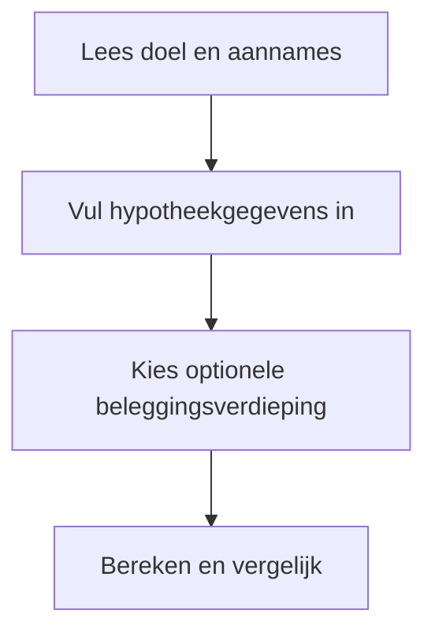
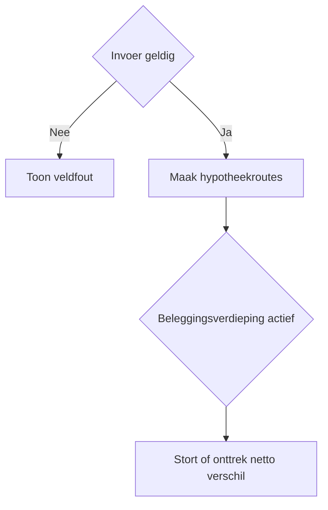
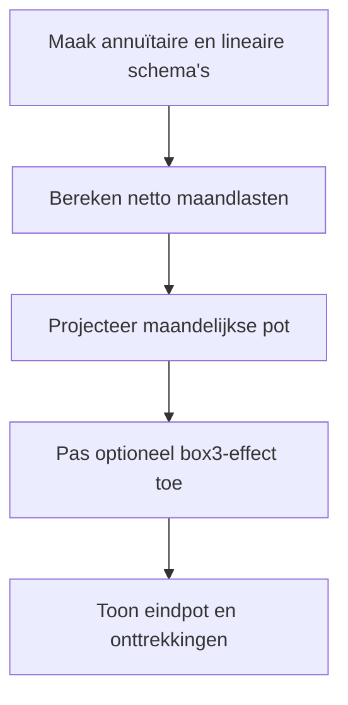

# Procesplaat annuïtair of lineair

## 1. Identificatie
Hypotheekvergelijker met optionele beleggingspot. De beleggingsroute gebruikt het netto maandlastverschil en is indicatief.

## 2. Gebruikersproces
Vul lening, rente en looptijd in. Optioneel: voer rendement in en laat het netto verschil maandelijks beleggen en later onttrekken.

## 3. Beslisproces
De calculator vergelijkt annuïtaire en lineaire maandlasten en activeert alleen de beleggingspot wanneer de gebruiker daarvoor kiest.

## 4. Rekenproces
Maandelijkse rente, aflossing, belastingfactor en netto lasten worden berekend. De pot groeit tegen het ingevoerde rendement; bij een negatief verschil wordt onttrokken. Box 3 is optioneel en volgt de gekozen methode.

## 5. Gegevensstroom en koppelingen
De calculator gebruikt lokale invoer en de centrale box-3-laag. Geen backend of profielopslag.

## 6. Resultaten en uitzonderingen
Toon maandlasten, totale rente, omslagmoment, eindpot vóór/na box 3 en totale onttrekking. Rendement en belasting zijn scenario-aannames.

## 7. Functionele bronverwijzingen
- `apps/annuitair-lineair/Calculator.tsx`
- `apps/annuitair-lineair/logic.ts`
- `apps/annuitair-lineair/mortgageCalculator.js`
- `apps/annuitair-lineair/investmentStrategy.js`
- `src/lib/tax/box3.ts`
