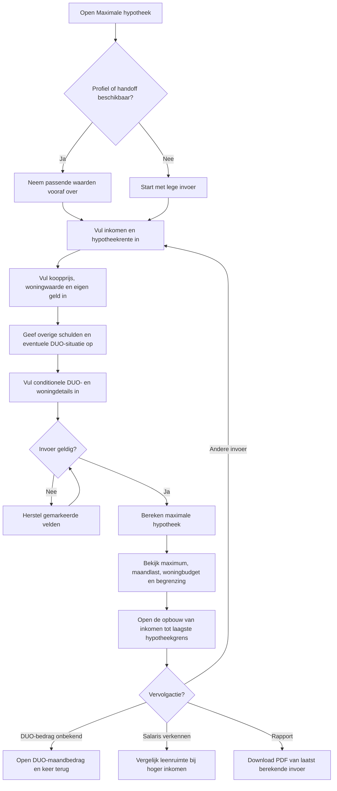
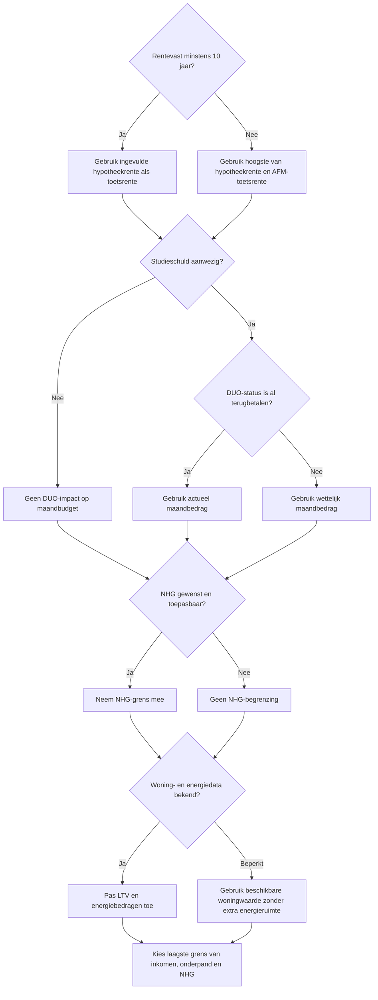
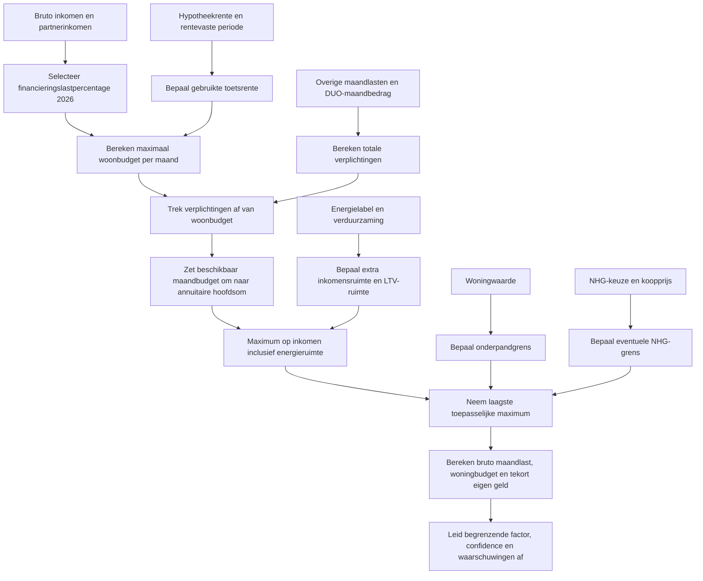
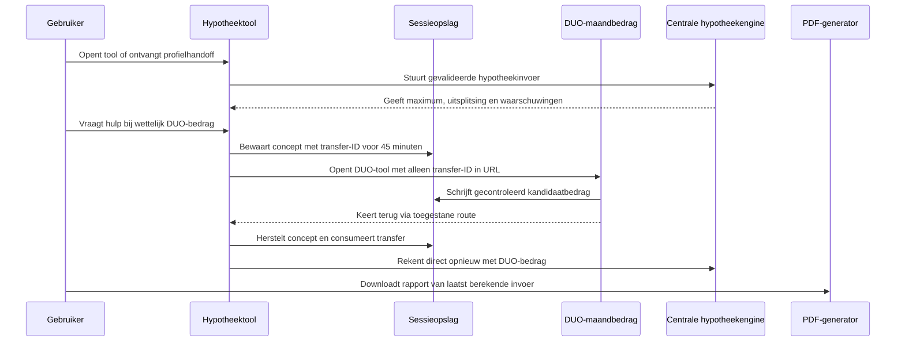

# Procesplaat Maximale hypotheek

## 1. Identificatie

- **Tool-ID:** `artifact-hypotheek-wonen-maximale-hypotheek`
- **Publieke route:** `/apps/artifact-hypotheek-wonen-maximale-hypotheek`.
- **Doel:** een indicatieve maximale hypotheek bepalen vanuit inkomen, rente, woning, eigen geld, overige schulden, studieschuld, NHG en energiegegevens.
- **Gecontroleerd op:** 2026-08-11.
- **Functionele basis:** formulier en orkestratie in `apps/artifact-hypotheek-wonen-maximale-hypotheek/Calculator.tsx`, mapping in `apps/artifact-hypotheek-wonen-maximale-hypotheek/logic.ts` en centrale berekening in `src/lib/mortgage/max-mortgage.ts`.

De procesplaten hieronder beschrijven de actieve implementatie. Het manifest heeft `enabled: true`; de tool en route worden via de publieke registry, navigatie en buildroutes gepubliceerd. Wijzigingen vereisen regeneratie en de genoemde inhoudelijke publicatiecontroles.

## 2. Gebruikersproces

## 3. Beslisproces

## 4. Rekenproces

De financieringslasttabel komt uit `src/lib/financial-constants/mortgage-financing-load-data.ts`. NHG-, LTV-, energie- en AFM-normen komen via `src/lib/financial-constants/index.ts`; studieschuldweging en de uiteindelijke minimumselectie staan in `src/lib/mortgage/max-mortgage.ts`.

## 5. Gegevensstroom en koppelingen

Profielprefill loopt via `src/lib/profile-tool-mapping.ts` en `src/lib/profile-prefill.ts`. Algemene handoffs gebruiken `src/lib/tool-handoff.ts`; de specifieke retourflow naar `duo-maandbedrag` gebruikt `src/lib/duo-mortgage-transfer.ts` en `sessionStorage`. Financiële bedragen worden niet in de URL gezet.

## 6. Resultaten en uitzonderingen

| Resultaat of status | Ontstaat uit | Wanneer zichtbaar | Belangrijk voor gebruiker |
| --- | --- | --- | --- |
| Indicatieve maximale hypotheek | Laagste toepasselijke inkomens-, onderpand- en NHG-grens | Na geldige berekening | Dit is geen bindend aanbod of advies. |
| Bruto maandlast | Annuiteit over het gekozen maximum | Na berekening | Gebruikt de ingevulde rente, terwijl de hoofdsom met toetsrente kan zijn begrensd. |
| Maximaal woningbudget | Hypotheek plus eigen geld min kosten en verbouwing | Als woninggegevens bestaan | Laat zien welke koopprijs indicatief past. |
| Begrenzende factor | Vergelijking van inkomen, woningwaarde en NHG | Na berekening | Verklaart waarom meer inkomen niet altijd meer leencapaciteit geeft. |
| Berekeningsopbouw | Inkomen, toetsrente, ruimte na verplichtingen en alle grenzen | Na openen van de verdieping | Toont dezelfde tussenuitkomsten en eventueel een hogere tabeluitkomst bij een andere toetsrente. |
| Salarisverkenning | Zelfde centrale engine met alternatief inkomen | Alleen na openen verdieping | Verandert de oorspronkelijke berekening niet. |
| PDF | Laatst gevalideerde invoer en hetzelfde resultaat | Na berekening | PDF rekent niet zelfstandig opnieuw. |

Voornaamste blokkades zijn ontbrekend inkomen, rente, looptijd of koopprijs en ontbrekend relevant DUO-maandbedrag. Waarschuwingen ontstaan onder meer bij indicatieve aannames, onvoldoende eigen geld, NHG- of woningwaardebegrenzing en fallback van de financieringslasttabel. Een verlopen of ongeldige DUO-transfer wordt niet toegepast; de gebruiker blijft bij zijn bestaande formulier.

## 7. Functionele bronverwijzingen

- `apps/artifact-hypotheek-wonen-maximale-hypotheek/app.json`: publicatie, titel en route-entry.
- `apps/artifact-hypotheek-wonen-maximale-hypotheek/Calculator.tsx`: zichtbare stappen, conditionele velden, profielprefill, submit en vervolgacties.
- `apps/artifact-hypotheek-wonen-maximale-hypotheek/logic.ts`: parsing, validatie en mapping naar hypotheekinput.
- `apps/artifact-hypotheek-wonen-maximale-hypotheek/salary-explorer.ts`: validatie en viewmodel voor de salarisverkenning.
- `apps/artifact-hypotheek-wonen-maximale-hypotheek/MortgageCalculationBreakdown.tsx`: toont de gecontroleerde tussenstappen, grenzen en eventuele hogere tabeluitkomst.
- `apps/artifact-hypotheek-wonen-maximale-hypotheek/report.ts`: PDF-opbouw vanuit hetzelfde resultaat.
- `src/lib/mortgage/max-mortgage.ts`: centrale hypotheekberekening, begrenzingen en waarschuwingen.
- `src/lib/financial-constants/mortgage-financing-load-data.ts`: officiële financieringslasttabellen.
- `src/lib/duo-mortgage-transfer.ts`: tijdelijke retourflow via sessieopslag.
- Regressies: `apps/artifact-hypotheek-wonen-maximale-hypotheek/logic.test.ts`, `apps/artifact-hypotheek-wonen-maximale-hypotheek/duo-transfer.test.ts` en `apps/artifact-hypotheek-wonen-maximale-hypotheek/salary-explorer.test.ts`.
