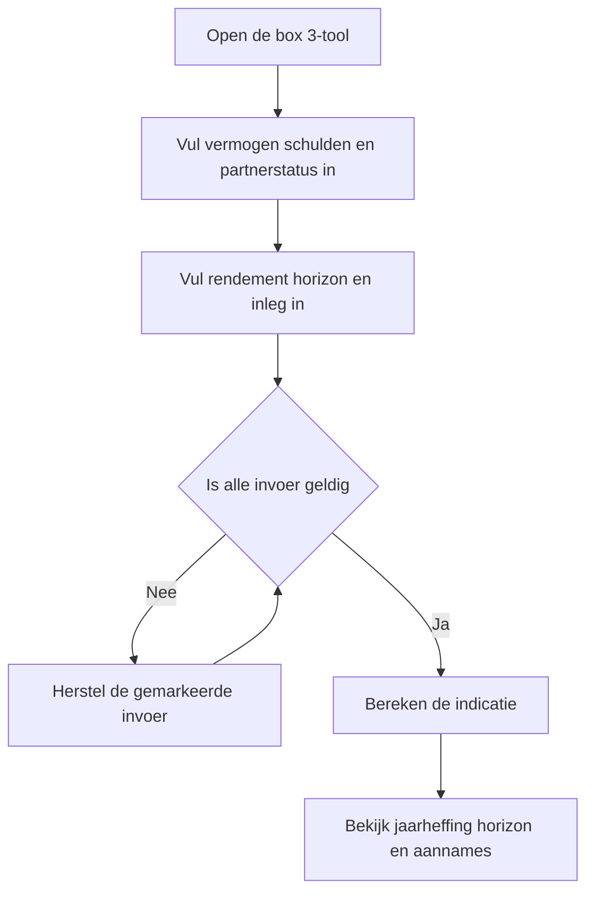
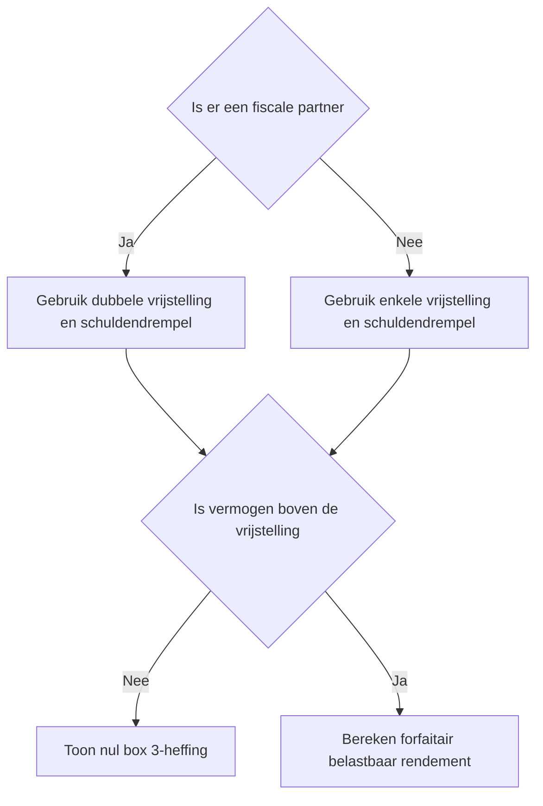
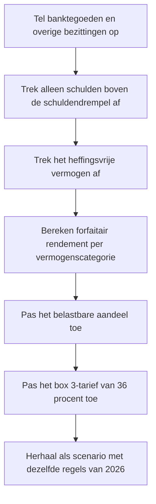

# Procesplaat Wat kost mijn vermogen in box 3?

## 1. Identificatie

- **Tool-ID:** `box-3-impact`
- **Publieke route:** `/apps/box-3-impact`
- **Doel:** de voorlopige forfaitaire box 3-heffing voor 2026 en een meerjarig scenario met dezelfde 2026-regels inzichtelijk maken.
- **Gecontroleerd op:** 2026-09-18.

## 2. Gebruikersproces

## 3. Beslisproces

## 4. Rekenproces

## 5. Gegevensstroom en koppelingen

De formulierwaarden blijven in de browser. `apps/box-3-impact/Calculator.tsx` valideert en mappt ze naar de dunne scenariofaçade in `apps/box-3-impact/logic.ts`. Die gebruikt `src/lib/tax/box3.ts`; tarieven, vrijstellingen en schuldendrempels komen centraal uit `src/lib/financial-constants/years.ts`. De tool slaat geen bedragen extern op.

## 6. Resultaten en uitzonderingen

De hoofdweergave toont de indicatieve box 3-heffing voor 2026. Details tonen onder meer schuldendrempel, aftrekbare schulden, rendementsgrondslag en forfaitair rendement. De horizon hergebruikt bewust de voorlopige 2026-regels en wordt expliciet als scenario getoond, niet als voorspelling. Ongeldige of negatieve invoer blokkeert de berekening.

## 7. Functionele bronverwijzingen

- `apps/box-3-impact/app.json`: publieke metadata.
- `apps/box-3-impact/Calculator.tsx`: invoer, validatie en resultaatpresentatie.
- `apps/box-3-impact/logic.ts`: scenariofaçade en horizonberekening.
- `src/lib/tax/box3.ts`: centrale box 3-berekening.
- `src/lib/financial-constants/years.ts`: centrale 2026-waarden en bronmetadata.
