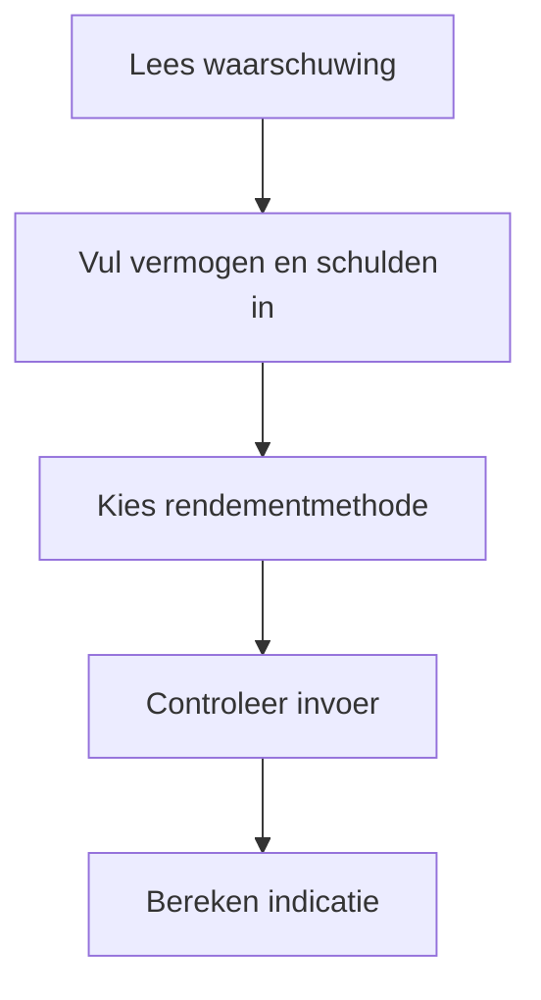
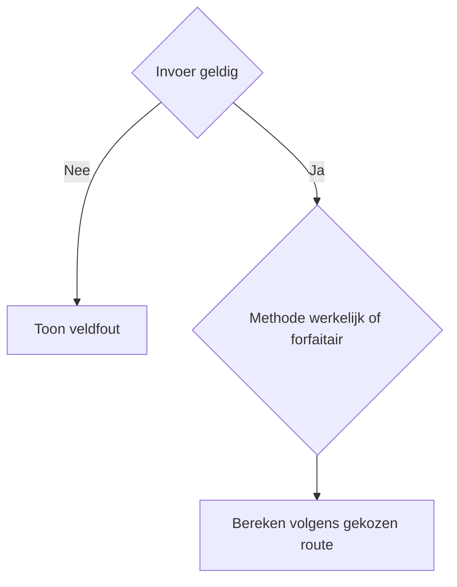
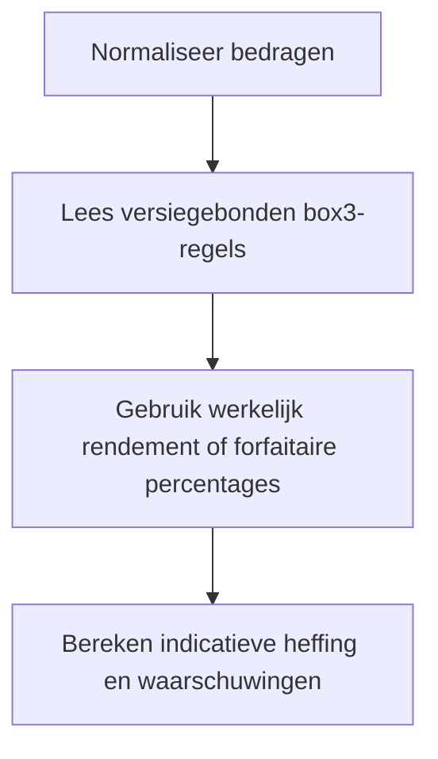

# Procesplaat Box 3-indicatie

## 1. Identificatie
Indicatieve fiscale tool voor spaargeld, beleggingen en schulden. Geen aangifte of persoonlijk belastingadvies.

## 2. Gebruikersproces
Vul vermogen, schulden, fiscale partner en jaar in en kies werkelijk of forfaitair rendement.

## 3. Beslisproces
De gekozen methode bepaalt welke rendementroute wordt gebruikt; ongeldige invoer blokkeert de uitkomst.

## 4. Rekenproces
De centrale box-3-laag past vrijstelling, schuldendrempel, rendement en tarief toe voor het gekozen jaar.

## 5. Gegevensstroom en koppelingen
De calculator geeft invoer door aan `calculateBox3Tax`. Er is geen backend of profielopslag; scherm en download delen hetzelfde resultaatmodel.

## 6. Resultaten en uitzonderingen
De tool toont methode, grondslag, indicatieve heffing en waarschuwingen. Werkelijk rendement is hier een vereenvoudigde projectie en geen officiële vaststelling.

## 7. Functionele bronverwijzingen
- `apps/box3-indicatie/app.json`
- `apps/box3-indicatie/Calculator.tsx`
- `apps/box3-indicatie/logic.ts`
- `apps/box3-indicatie/logic.test.ts`
- `src/lib/tax/box3.ts`
- `src/lib/tax/types.ts`
