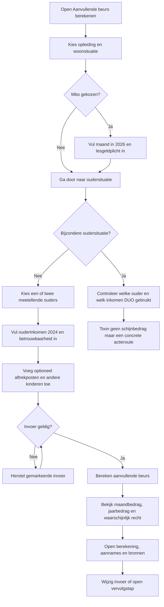
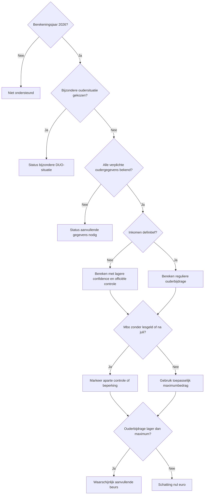
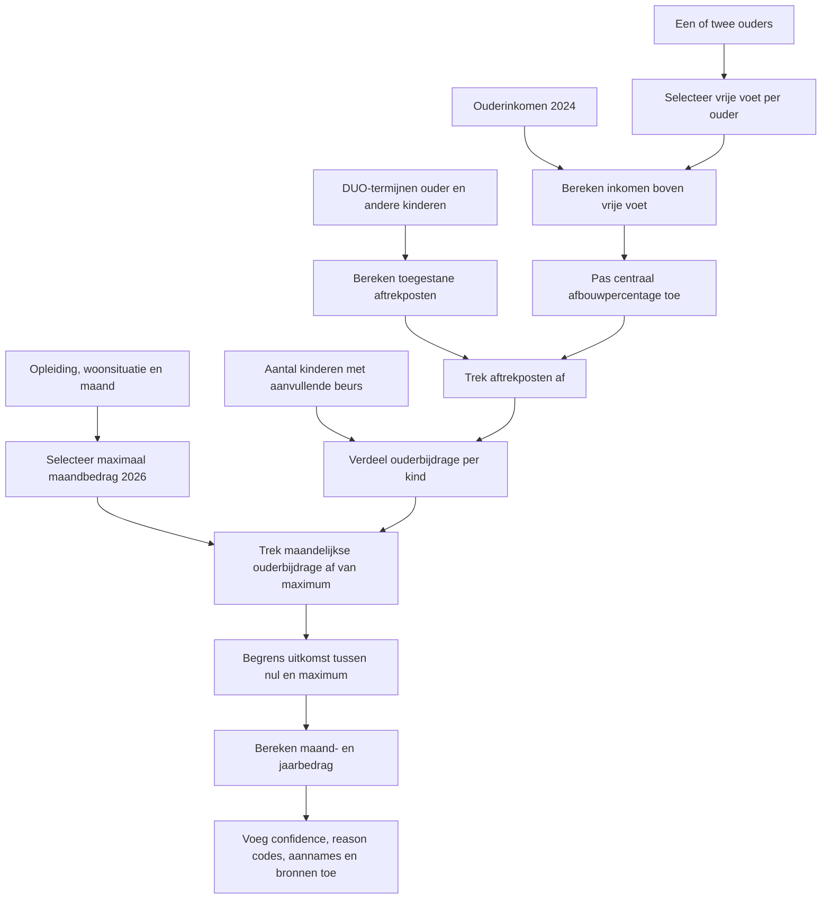
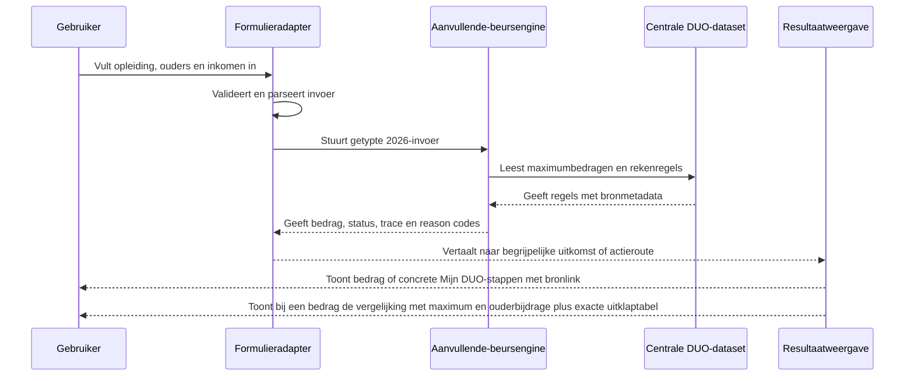

# Procesplaat Aanvullende beurs berekenen

## 1. Identificatie

- **Tool-ID:** `duo-aanvullende-beurs`
- **Publieke route:** `/apps/duo-aanvullende-beurs`
- **Doel:** de aanvullende beurs voor 2026 indicatief berekenen voor een reguliere ouder- en inkomenssituatie en bijzondere situaties veilig apart behandelen.
- **Gecontroleerd op:** 2026-07-31.
- **Functionele basis:** formulier en resultaat in `apps/duo-aanvullende-beurs/Calculator.tsx`, adapter in `apps/duo-aanvullende-beurs/logic.ts` en officiële centrale engine in `src/lib/duo/additional-grant/index.ts`.

## 2. Gebruikersproces

## 3. Beslisproces

Op mobiel doorloopt de gebruiker één betekenisvolle vraag per scherm. De mbo-maand en lesgeldplicht verschijnen alleen bij een mbo-opleiding; de tweede ouder verschijnt alleen bij twee meetellende ouders. Ouderinkomen en de status van dat inkomen vormen samen één stap. Enter gaat bij geldige numerieke invoer verder, een ongeldige stap blijft staan met een veldfout en de laatste stap gebruikt `Bekijk uitkomst`. Bij een bijzondere oudersituatie vervangt een korte uitleg met drie concrete Mijn DUO-stappen het reguliere inkomenstraject en de tool toont bewust geen bedrag. Op desktop blijven de velden compact bij elkaar.

## 4. Rekenproces

De engine gebruikt de getraceerde regels in `src/lib/financial-constants/duo-additional-grant-rules-2026.ts`. Maximale studiefinancieringsbedragen per periode zijn centraal vastgelegd in `src/lib/financial-constants/duo-student-finance-amounts-2026.ts`.

Bronregister-review 20 september 2026: de aparte dataset `tax-proposal-rules` is uitsluitend voor verborgen belastingconcepten toegevoegd. De DUO-datasets, selectie, formules en gebruikersflow hierboven veranderen niet; de voorstelversie wordt niet door deze tool geselecteerd.

## 5. Gegevensstroom en koppelingen

Er is geen profielprefill, sessieherstel, URL-invoer of functionele handoff naar deze tool gevonden. De tool bewaart ouderinkomens niet persistent en heeft geen PDF-uitvoer. Vervolgacties zijn gewone links uit `src/lib/tool-journeys.ts`, zonder overdracht van bedragen.

## 6. Resultaten en uitzonderingen

| Resultaat of status | Ontstaat uit | Wanneer zichtbaar | Belangrijk voor gebruiker |
| --- | --- | --- | --- |
| Waarschijnlijk aanvullende beurs | Berekend bedrag groter dan nul | Na geldige reguliere berekening | DUO stelt het officiële bedrag vast. |
| Waarschijnlijk geen aanvullende beurs | Ouderbijdrage bereikt het maximum | Na geldige berekening | De schatting is nul, niet een formele afwijzing. |
| Vergelijkingsgrafiek en tabel | Maximum, berekende ouderbijdrage en geschatte beurs uit dezelfde result-view | Bij een berekend regulier bedrag | De grafiek geeft verhouding; de gesloten tabel toont exact dezelfde maandbedragen. |
| Officiële controle nodig | Geschat of onzeker ouderinkomen | Na berekening met lagere confidence | Een latere inkomenscorrectie kan terugbetaling geven. |
| Bijzondere DUO-situatie | Overleden, onbekende, buitenlandse of buiten beschouwing te laten ouder | Na berekenen | De reguliere formule wordt bewust niet toegepast; de gebruiker ziet welke ouder- en inkomensgegevens in Mijn DUO gecontroleerd moeten worden en welke vervolgstap past. |
| Aanvullende gegevens nodig | Verplichte opleiding-, ouder- of inkomensdata ontbreekt | Voor resultaat | Er verschijnt geen berekend bedrag. |

Validatie accepteert negatieve ouderinkomens wanneer DUO die zo verwerkt, maar geldvelden en aantallen moeten verder geldig zijn. Mbo zonder lesgeldplicht en mbo-perioden na juli hebben expliciete reason codes en beperkingen. Er is geen PDF- of opslagvoorwaarde.

## 7. Functionele bronverwijzingen

- `apps/duo-aanvullende-beurs/app.json`: publieke identiteit en status.
- `apps/duo-aanvullende-beurs/Calculator.tsx`: conditionele formulierstappen en resultaatpresentatie.
- `apps/duo-aanvullende-beurs/logic.ts`: validatie, mapping, statuslabels en waarschuwingen.
- `src/lib/duo/additional-grant/index.ts`: pure berekening, trace, confidence en reason codes.
- `src/lib/financial-constants/duo-additional-grant-rules-2026.ts`: officiële 2026-regels en bronwaarden.
- `src/lib/financial-constants/source-datasets.ts`: bronmetadata, geldigheid en freshness.
- Regressies: `apps/duo-aanvullende-beurs/logic.test.ts` en `src/lib/duo/additional-grant/additional-grant.test.ts`.
