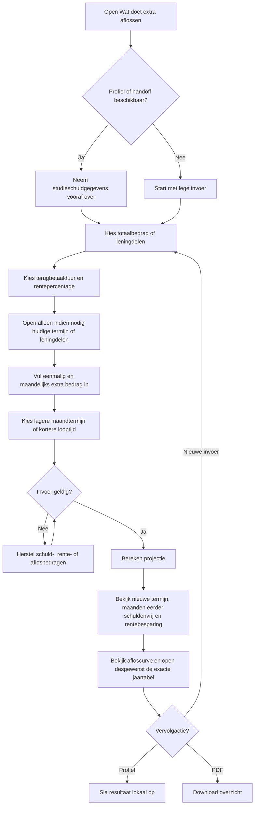
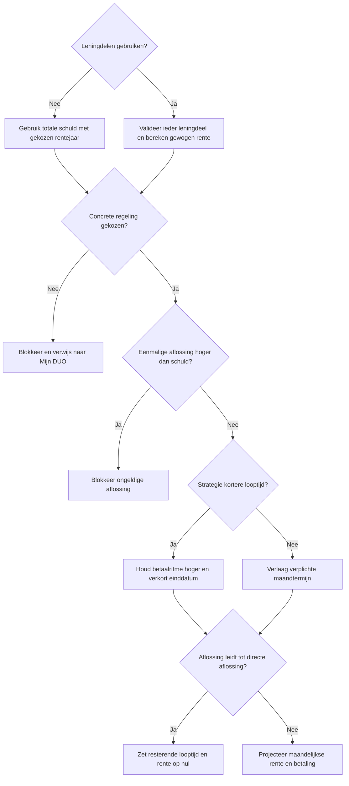
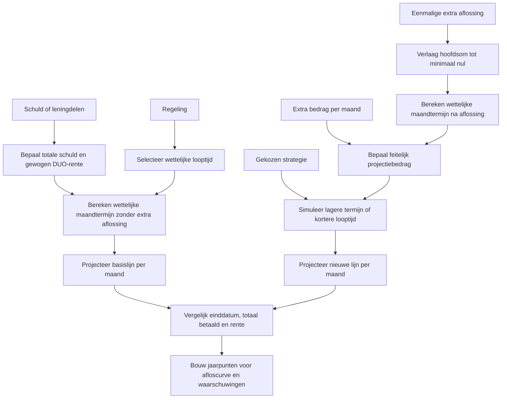
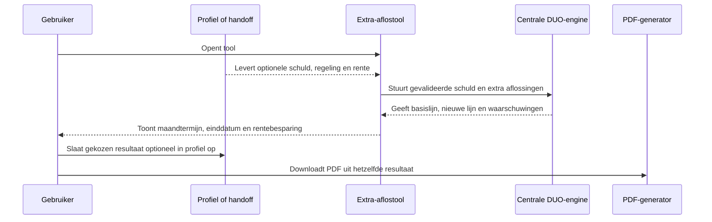

# Procesplaat Wat doet extra aflossen?

## 1. Identificatie

- **Tool-ID:** `duo-extra-aflossen`
- **Publieke route:** `/apps/duo-extra-aflossen`
- **Doel:** het effect van eenmalig en maandelijks extra aflossen tonen op DUO-maandtermijn, looptijd en rente.
- **Gecontroleerd op:** 2026-07-31.
- **Functionele basis:** formulier in `apps/duo-extra-aflossen/Calculator.tsx`, adapter in `apps/duo-extra-aflossen/logic.ts` en centrale projectie in `src/lib/duo/calculations.ts`.

## 2. Gebruikersproces

## 3. Beslisproces

Op mobiel zijn alleen schuld, terugbetaalduur, rentepercentage, beide extra aflossingen en strategie afzonderlijke stappen. Huidige termijn en leningdelen staan achter `Nauwkeuriger rekenen` en vormen geen lege mobiele vraag. Het rentejaar vervalt als leningdelen worden gebruikt. De mobiele actie blijft tijdens scrollen onderin bereikbaar. Een resultaat verschijnt pas na `Bekijk uitkomst`; `Invoer wijzigen` bewaart alle antwoorden en een herstart wist na bevestiging alleen deze tool.

## 4. Rekenproces

## 5. Gegevensstroom en koppelingen

Profiel- en handoffwaarden worden lokaal verwerkt via `src/lib/profile-tool-mapping.ts` en `src/lib/tool-handoff.ts`. De tool heeft geen speciale retourflow naar een andere calculator. PDF-data komt uit de gevalideerde view en `apps/duo-extra-aflossen/report.ts`; er is geen tweede berekening.

## 6. Resultaten en uitzonderingen

| Resultaat of status | Ontstaat uit | Wanneer zichtbaar | Belangrijk voor gebruiker |
| --- | --- | --- | --- |
| Nieuwe verplichte maandtermijn | Resterende schuld na eenmalige aflossing | Na geldige berekening | Kan verschillen van het bedrag dat de gebruiker vrijwillig blijft betalen. |
| Maanden eerder schuldenvrij en nieuwe einddatum | Maandelijkse simulatie volgens gekozen strategie | Direct in het hoofdresultaat | Kortere looptijd ontstaat alleen bij passend betaalgedrag. |
| Indicatieve rentebesparing | Verschil tussen beide projecties | Na berekening | Afhankelijk van gekozen rentejaar en constant renteverloop. |
| Afloscurve en tabel | Jaarlijkse sluitstanden uit beide centrale tijdlijnen | Direct na het hoofdresultaat; tabel standaard gesloten | Maakt het verschil zichtbaar en houdt dezelfde exacte jaarbedragen controleerbaar. |
| PDF | Laatste geldige view | Na berekening | Gebruikt hetzelfde projectieresultaat als het scherm. |

Onbekende regeling, ongeldige leningdelen, negatieve bedragen en een eenmalige aflossing boven de schuld blokkeren. De centrale engine waarschuwt onder meer wanneer het huidige maandbedrag niet past bij de wettelijke termijn of wanneer een projectie de maximale simulatiehorizon raakt.

## 7. Functionele bronverwijzingen

- `apps/duo-extra-aflossen/app.json`: publieke identiteit en status.
- `apps/duo-extra-aflossen/Calculator.tsx`: formulier, profielprefill, strategie en resultaatweergave.
- `apps/duo-extra-aflossen/logic.ts`: validatie, schuldportefeuille en grafiekdata.
- `apps/duo-extra-aflossen/report.ts`: PDF vanuit de berekende view, met paginacontrole vóór ieder inhoudsblok.
- `src/lib/duo/calculations.ts`: wettelijke termijn, extra-aflosprojectie en tijdlijnen.
- `src/lib/duo/debt-parts-form.ts`: validatie en normalisatie van leningdelen.
- `src/lib/financial-constants/duo-rate-history.ts`: beschikbare rentejaren en percentages.
- Regressies: `apps/duo-extra-aflossen/logic.test.ts` en `apps/duo-extra-aflossen/report.test.ts`.
