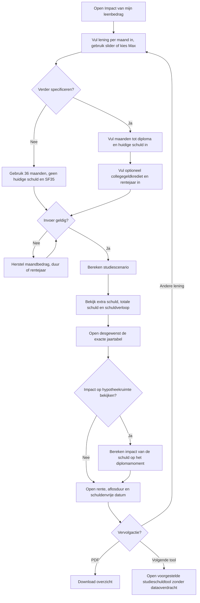
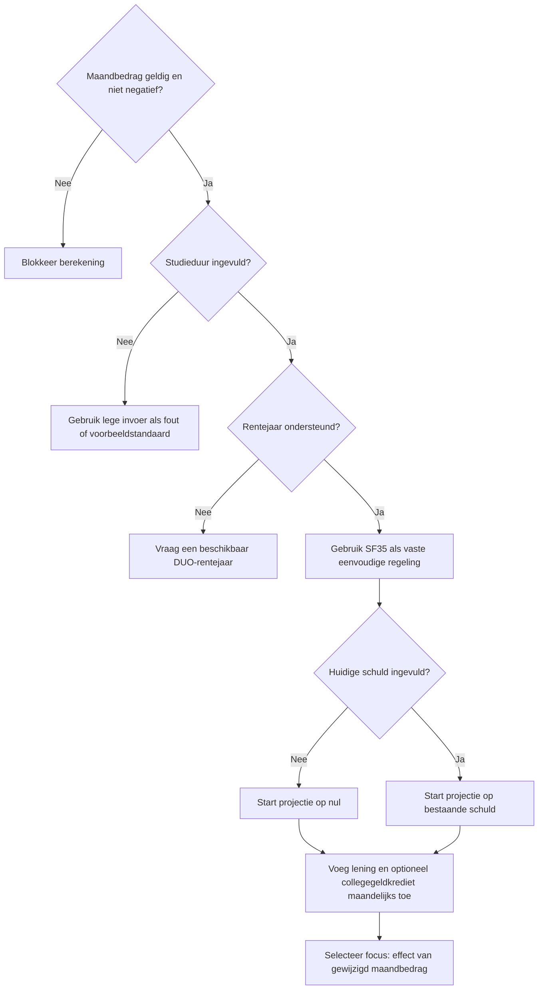
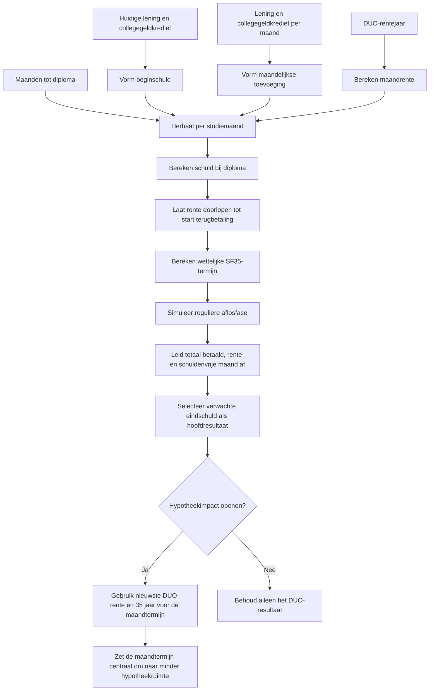
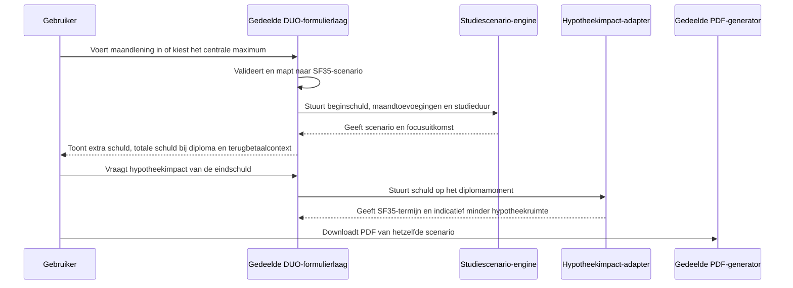

# Procesplaat Impact van mijn leenbedrag

## 1. Identificatie

- **Tool-ID:** `duo-leenbedrag-impact`
- **Publieke route:** `/apps/duo-leenbedrag-impact`
- **Doel:** laten zien wat een gekozen maandelijkse DUO-lening doet met eindschuld en terugbetaling tijdens een lopende studie.
- **Gecontroleerd op:** 2026-07-31.
- **Functionele basis:** mode `monthly-impact` in `apps/_duo_simple/FocusedDuoTool.tsx`, mapping in `apps/_duo_simple/focused-logic.ts` en scenario-engine in `src/lib/duo/studeren-stoppen.ts`.

## 2. Gebruikersproces

## 3. Beslisproces

Op mobiel is het leenbedrag de centrale snelle stap; de gekoppelde slider en exacte numerieke invoer delen dezelfde waarde. Enter of `Bekijk uitkomst` rondt de geldige laatste stap af en de actie blijft tijdens scrollen onderin bereikbaar. De optionele specificatie staat standaard gesloten onder `Nauwkeuriger berekenen` en is geen extra mobiele vraag. Na de uitkomst brengt `Invoer wijzigen` de gebruiker terug met behoud van alle waarden; opnieuw beginnen vereist bevestiging en wist alleen deze tool.

## 4. Rekenproces

De eenvoudige flow gebruikt bewust SF35 en geen regelingselector. De actuele beursbedragen dienen alleen als voorbeelddefaults in de gedeelde invoer; de feitelijke berekening gebruikt uitsluitend wat de gebruiker invoert.

## 5. Gegevensstroom en koppelingen

Er is geen profielprefill, sessieherstel of persistente opslag. Vervolglinks uit `src/lib/tool-journeys.ts` dragen geen bedragen over. De taakgerichte PDF-renderer staat in `apps/_duo_simple/report.ts`, gebruikt dezelfde geldige view als het scherm en maakt een compact overzicht voor deze gebruikersvraag.

## 6. Resultaten en uitzonderingen

| Resultaat of status | Ontstaat uit | Wanneer zichtbaar | Belangrijk voor gebruiker |
| --- | --- | --- | --- |
| Extra schuld door dit leenbedrag | Verschil met direct stoppen | Na geldige berekening | Maakt de invloed van het gekozen maandbedrag direct zichtbaar. |
| Verwachte totale schuld bij diploma | Totale schuld in het doorstudeerscenario | Direct naast de extra schuld | Gebaseerd op opgegeven maandlening, bestaande schuld en studieduur. |
| Schuldverloop en jaartabel | Jaarlijkse laatste standen uit dezelfde scenario-tijdlijn | Direct na de kernbedragen; tabel standaard gesloten | Laat studie, aanloop en terugbetaling zien zonder een tweede berekening. |
| Maximale maandlening | Centrale norm voor de gekozen berekeningsmaand | Direct in het leningveld | `Max` vult de norm met één actie in; de gebruiker kan het bedrag daarna aanpassen. |
| Collegegeldkrediet en reisproduct | Centrale jaar- en maandnormen | Bij invoer van verdiepende maandbedragen | Collegegeldkrediet is jaarlijks wettelijk collegegeld gedeeld door 12; reisproduct telt als prestatiebeurs zolang het geen gift is. |
| Hypotheekimpact eindschuld | Schuld op het diplomamoment, nieuwste DUO-rente en centrale hypotheekdefaults | Na één druk op de impactknop | Indicatie zonder inkomen, draagkracht, andere schulden, woningwaarde of bankbeleid. |
| Totaal terug te betalen | Reguliere SF35-projectie | In resultaatdetails | Inclusief modelrente, zonder persoonlijke draagkracht. |
| Rente in aflosfase | Verschil tussen terugbetaling en startsaldo | In verdieping | Rentepercentages kunnen later veranderen. |
| Schuldenvrij rond | Maandsimulatie van aflossing | In verdieping | Indicatief, geen DUO-beschikking. |
| PDF | Dezelfde taakgerichte view | Na resultaat | Compacte invoer en dezelfde kernbedragen als op het scherm; geen zelfstandig rekenpad. |

Ongeldige maanden, negatieve bedragen of een onbekend rentejaar blokkeren. Als lening en beursbedragen samen boven de centrale maandnorm uitkomen, noemt de foutmelding ook de resterende maximale leenruimte bij de ingevulde beursbedragen. De engine waarschuwt dat toekomstige rente en persoonlijke draagkracht kunnen afwijken.

## 7. Functionele bronverwijzingen

- `apps/duo-leenbedrag-impact/app.json`: publieke identiteit.
- `apps/duo-leenbedrag-impact/Calculator.tsx`: activeert de gedeelde `monthly-impact`-modus.
- `apps/_duo_simple/FocusedDuoTool.tsx`: velden met centrale `Max`-actie, verdieping, submit, resultaat en PDF.
- `apps/_duo_simple/focused-logic.ts`: defaults, validatie, mapping en focusselectie.
- `apps/_duo_simple/report.ts`: taakgerichte PDF met dezelfde view en begrijpelijke bestandsnaam.
- `apps/_duo_simple/ProjectedDebtMortgageImpact.tsx`: toont de optionele hypotheekimpact na een expliciete gebruikersactie.
- `apps/_duo_simple/projected-debt-mortgage-impact.ts`: vertaalt de eindschuld via de centrale DUO- en hypotheekfuncties naar een indicatie.
- `src/lib/duo/studeren-stoppen.ts`: studie-, aanloop- en aflossimulatie.
- Regressies: `apps/duo-leenbedrag-impact/logic.test.ts` en `src/lib/duo/studeren-stoppen.test.ts`.
