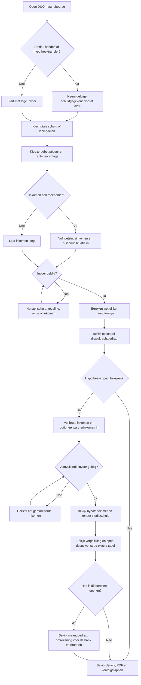
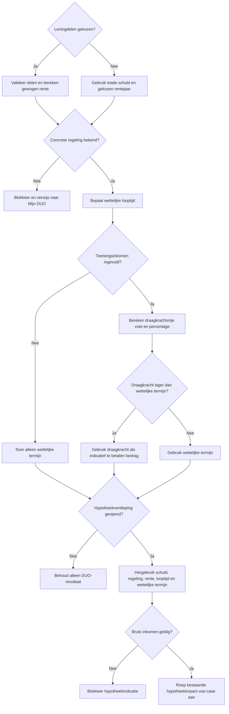
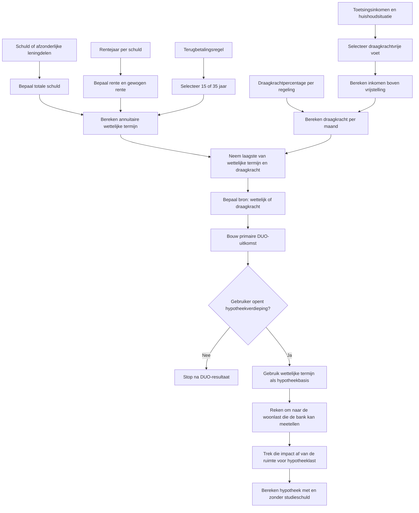
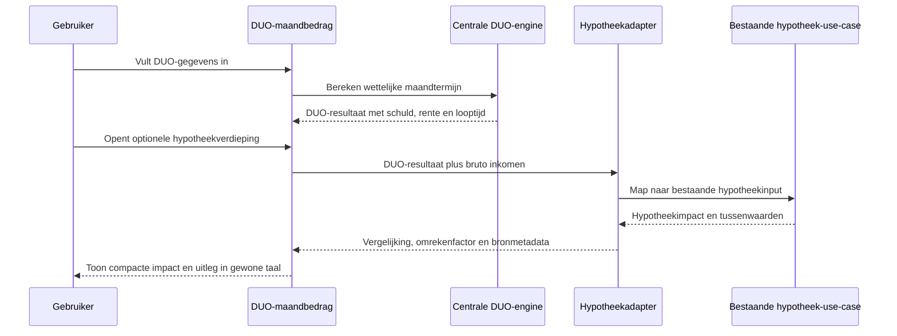

# Procesplaat Wat wordt mijn DUO-maandbedrag?

## 1. Identificatie

- **Tool-ID:** `duo-maandbedrag`
- **Publieke route:** `/apps/duo-maandbedrag`
- **Doel:** de wettelijke DUO-maandtermijn berekenen, optioneel een draagkrachtindicatie tonen en daarna desgewenst de hypotheekimpact verdiepen zonder een tweede publieke calculator te openen.
- **Gecontroleerd op:** 2026-07-31.
- **Functionele basis:** `apps/duo-maandbedrag/Calculator.tsx`, adapter `apps/duo-maandbedrag/logic.ts` en centrale DUO-functies in `src/lib/duo/calculations.ts`.

## 2. Gebruikersproces

## 3. Beslisproces

Op mobiel doorloopt de gebruiker eerst alleen schuld, terugbetaalduur en rentepercentage. Leningdelen en een mogelijke verlaging op basis van inkomen staan in afzonderlijke, standaard gesloten verdiepingen en zijn geen lege mobiele stappen. Het rentejaar verdwijnt wanneer leningdelen actief zijn. De mobiele actie blijft tijdens scrollen bereikbaar. De laatste actie heet `Bekijk uitkomst`; zonder inkomensgegevens toont het hoofdresultaat alleen de wettelijke maandtermijn en met inkomen daarnaast het lagere indicatieve bedrag.

## 4. Rekenproces

Voor `SF15_OLD` is geen eenvoudig centraal draagkrachtpercentage beschikbaar; die situatie blijft expliciet beperkt en gewaarschuwd. Rentehistorie, looptijden en draagkrachtregels komen via `src/lib/financial-constants/index.ts`.

## 5. Gegevensstroom en koppelingen

De publieke verdieping gebruikt geen URL-parameters of persistente overdracht. De afgeronde DUO-view blijft lokaal in de calculator en wordt immutable aan de adapter doorgegeven. Bestaande profielprefill blijft ongewijzigd; de PDF gebruikt dezelfde DUO-view en controleert paginaruimte voordat een nieuw inhoudsblok wordt geplaatst. Bedragen staan niet in de URL.

## 6. Resultaten en uitzonderingen

| Resultaat of status | Ontstaat uit | Wanneer zichtbaar | Belangrijk voor gebruiker |
| --- | --- | --- | --- |
| Wettelijke maandtermijn | Schuld, rente en wettelijke looptijd | Na geldige berekening | Dit is de termijn volgens het gekozen schuldmodel. |
| Indicatief draagkrachtbedrag | Inkomen boven vrije voet en percentage | Alleen met toetsingsinkomen | DUO stelt draagkracht jaarlijks officieel vast. |
| Hypotheek met en zonder studieschuld | Bestaande hypotheekimpact-use-case | Alleen na openen, geldige inkomensinvoer en berekenen | Laat de indicatieve leencapaciteitsimpact zien. |
| Hypotheekvergelijking en tabel | Dezelfde maximale hypotheek met en zonder studieschuld | Direct bij de hypotheekuitkomst; tabel standaard gesloten | De balken tonen de verhouding en de tabel noemt beide bedragen en het verschil exact. |
| Omrekening voor de hypotheek | Wettelijke termijn en centrale hypotheekconstants | Alleen binnen `Hoe is dit berekend?` | Legt in gewone taal uit welke woonlast de bank kan meetellen; de technische term brutering staat pas in de toelichting. |
| Gewogen rente | Meerdere leningdelen | Alleen bij leningdelen | Elk deel behoudt eigen rentejaar in de berekening. |
| PDF | Geldige view | Na berekening | Gebruikt hetzelfde resultaat. |

Onbekende regeling, ongeldige schuld, ongeldige leningdelen of een niet-ondersteund rentejaar blokkeren het DUO-resultaat. Ontbrekend of negatief hypotheekinkomen blokkeert alleen de optionele hypotheekindicatie. Sluiten en heropenen van de verdieping behoudt de lokale invoer; opnieuw beginnen met de DUO-tool verwijdert ook de verdieping.

## 7. Functionele bronverwijzingen

- `apps/duo-maandbedrag/app.json`: publieke identiteit.
- `apps/duo-maandbedrag/Calculator.tsx`: formulier, transferstatus, profiel, resultaat en PDF.
- `apps/duo-maandbedrag/logic.ts`: validatie, portefeuille, draagkracht en transferkandidaat.
- `apps/duo-maandbedrag/MortgageImpactDepth.tsx`: standaard gesloten invoer-, resultaat- en uitlegverdieping.
- `apps/duo-maandbedrag/mortgage-depth.ts`: pure mapping van de DUO-view naar de bestaande hypotheekimpact-use-case.
- `apps/hypotheek-impact-studieschuld/logic.ts`: bestaande hypotheekimpactberekening en gestructureerde tussenuitkomsten.
- `src/lib/duo/calculations.ts`: wettelijke termijn en draagkrachtindicatie.
- `src/lib/duo/mortgage-assessment.ts`: keuze van relevant hypotheektoetsbedrag.
- `src/lib/duo-mortgage-transfer.ts`: tijdelijke sessie- en retourflow.
- `apps/duo-maandbedrag/report.ts`: PDF uit dezelfde view, met paginacontrole vóór ieder inhoudsblok.
- Regressies: `apps/duo-maandbedrag/logic.test.ts`, `apps/duo-maandbedrag/mortgage-depth.test.ts`, `apps/duo-maandbedrag/report.test.ts` en `src/lib/duo/mortgage-assessment.test.ts`.
