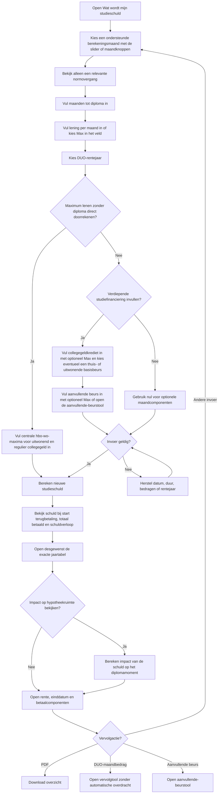
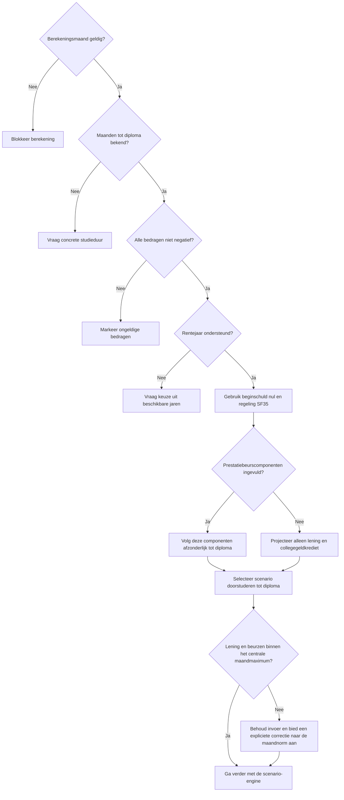
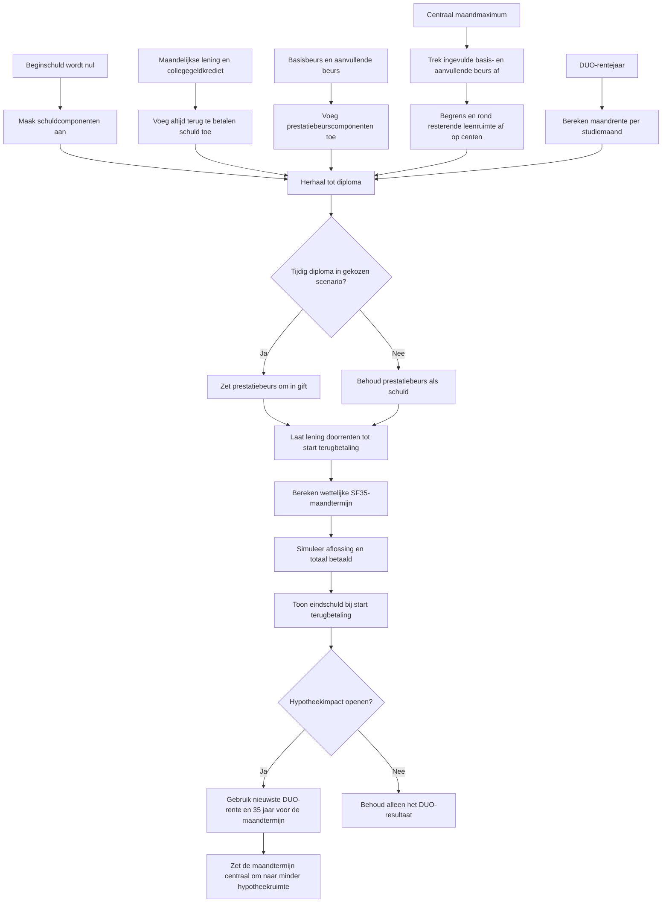
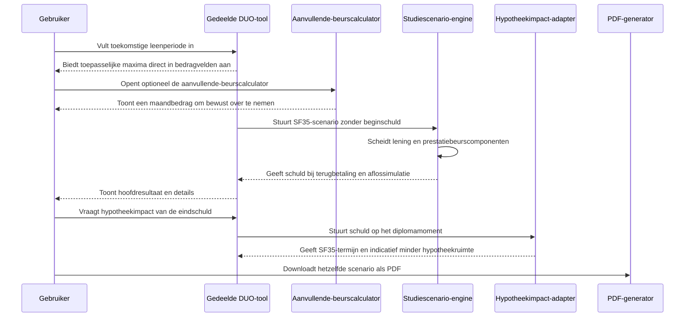

# Procesplaat Wat wordt mijn studieschuld?

## 1. Identificatie

- **Tool-ID:** `duo-schuld-bij-starten-lenen`
- **Publieke route:** `/apps/duo-schuld-bij-starten-lenen`
- **Doel:** de toekomstige studieschuld ramen voor iemand die zonder beginschuld een nieuwe leenperiode start.
- **Gecontroleerd op:** 2026-08-01.
- **Functionele basis:** mode `start-borrowing` in `apps/_duo_simple/FocusedDuoTool.tsx` en centrale scenario-engine in `src/lib/duo/studeren-stoppen.ts`.

## 2. Gebruikersproces

## 3. Beslisproces

Op mobiel worden berekeningsmaand, resterende hele studiemaanden, lening en rentepercentage één voor één getoond. De maandselector en exacte bedragen blijven gekoppeld aan dezelfde invoer. Enter gaat bij geldige invoer verder en de laatste actie heet `Bekijk uitkomst`; de actie blijft tijdens scrollen onderin bereikbaar. De optionele studiebedragen staan standaard gesloten achter `Andere studiebedragen` en vormen geen extra mobiele stappen. Na het resultaat blijft invoer bij wijzigen behouden; opnieuw beginnen wist na bevestiging alleen deze tool.

## 4. Rekenproces

## 5. Gegevensstroom en koppelingen

Er is geen profielprefill, session storage of persistente gegevensoverdracht. De aanvullende-beurskoppeling en de link naar een volgende tool zijn navigatie zonder ingevulde bedragen; een beursbedrag wordt alleen handmatig overgenomen. PDF-uitvoer gebruikt de taakgerichte module `apps/_duo_simple/report.ts` en exact dezelfde geldige view als het scherm.

## 6. Resultaten en uitzonderingen

| Resultaat of status | Ontstaat uit | Wanneer zichtbaar | Belangrijk voor gebruiker |
| --- | --- | --- | --- |
| Eindschuld bij start terugbetaling | Lening plus rente na studie en aanloopfase | Na geldige berekening | Prestatiebeurs wordt alleen als gift behandeld in het diplomascenario. |
| Schuldverloop en jaartabel | Jaarlijkse laatste standen uit dezelfde scenario-tijdlijn | Direct na de kernbedragen; tabel standaard gesloten | Laat de opbouw tijdens studie en daling tijdens terugbetalen zien. |
| Maximumscenario zonder diploma | Centrale maximale hbo/wo-bedragen en gekozen studieduur | Na de expliciete maximumactie | Regulier collegegeldkrediet is jaarcollegegeld gedeeld door 12. De centrale reisproductwaarde telt als prestatiebeurs mee zolang die geen gift is. |
| Maandnorm en normovergang | Periodegebonden centrale DUO-bedragen | Bij het toepasselijke bedragveld en bij een relevante overgang | De volledige normtabel blijft uit de hoofdflow; de tool toont het toepasselijke maximum en wijzigt bestaande invoer nooit stil. |
| Resterende leenruimte per maand | Centraal maandmaximum min ingevulde basis- en aanvullende beurs | In het leningveld en bij overschrijding | `Max` vult de actuele resterende leenruimte direct in; het bedrag blijft handmatig wijzigbaar. |
| Basisbeurs thuis- of uitwonend | Periodegebonden centrale DUO-bedragen | In de verdieping | Beide bedragen staan afzonderlijk klaar om over te nemen. |
| Aanvullende-beursschatting | Centrale aanvullende-beurscalculator | Na openen van de info-uitleg | De koppeling draagt geen persoonsgegevens of bedragen automatisch over. |
| Hypotheekimpact eindschuld | Schuld op het diplomamoment, nieuwste DUO-rente en centrale hypotheekdefaults | Na één druk op de impactknop | Indicatie zonder inkomen, draagkracht, andere schulden, woningwaarde of bankbeleid. |
| Totaal terug te betalen | SF35-aflossimulatie | Hoofdresultaat | Inclusief geraamde rente. |
| Rente in aflosfase | Aflossimulatie | In verdieping | Toekomstige rente kan afwijken. |
| Schuldenvrije maand | Einde van simulatie | In verdieping | Persoonlijke draagkracht kan de looptijd veranderen. |
| PDF | Zelfde taakgerichte view | Na berekening | Compacte invoer en dezelfde eindschuld, totale terugbetaling en rente; geen aparte formule. |

De berekening wordt niet uitgevoerd bij een niet-ondersteunde maand, ontbrekende studieduur, negatieve bedragen of onbekend rentejaar. Als de gebruiker naar een maand met lagere normen gaat, blijft de bestaande invoer zichtbaar en biedt de tool per te hoog bedrag een expliciete correctieknop. Als lening en beursbedragen samen boven de centrale maandnorm uitkomen, noemt de foutmelding de resterende maximale leenruimte bij de gekozen beursbedragen. De tool ondersteunt bewust alleen het eenvoudige SF35-pad.

## 7. Functionele bronverwijzingen

- `apps/duo-schuld-bij-starten-lenen/app.json`: publieke route en metadata.
- `apps/duo-schuld-bij-starten-lenen/Calculator.tsx`: activeert `start-borrowing`.
- `apps/_duo_simple/FocusedDuoTool.tsx`: formulier met centrale `Max`-acties, verdieping, resultaat en PDF.
- `apps/_duo_simple/focused-logic.ts`: dwingt beginschuld nul en SF35 af en bouwt op verzoek het centrale maximumscenario met de afgeleide collegegeld- en reisproductnormen.
- `apps/_duo_simple/report.ts`: taakgerichte PDF met dezelfde view en begrijpelijke bestandsnaam.
- `apps/duo-aanvullende-beurs/app.json`: borgt de publieke doelroute van de aanvullende-beurskoppeling.
- `apps/_duo_simple/ProjectedDebtMortgageImpact.tsx`: toont de optionele hypotheekimpact na een expliciete gebruikersactie.
- `apps/_duo_simple/projected-debt-mortgage-impact.ts`: vertaalt de eindschuld via de centrale DUO- en hypotheekfuncties naar een indicatie.
- `src/lib/duo/studeren-stoppen.ts`: component-, diploma-, rente- en aflossimulatie, inclusief optioneel doorstuderen zonder diploma.
- Regressies: `apps/duo-schuld-bij-starten-lenen/logic.test.ts` en `src/lib/duo/studeren-stoppen.test.ts`.
