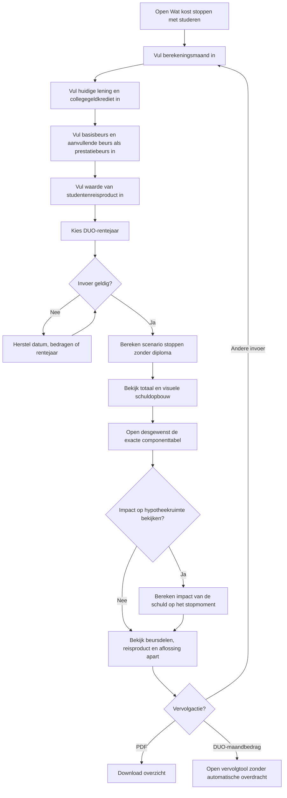
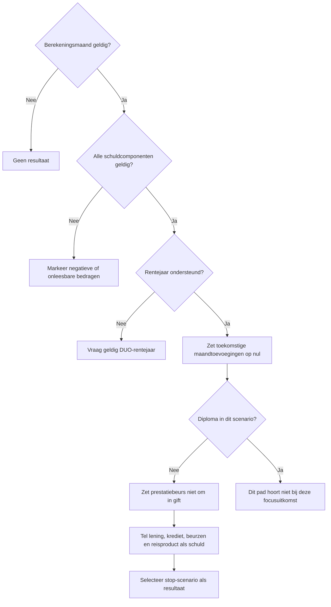
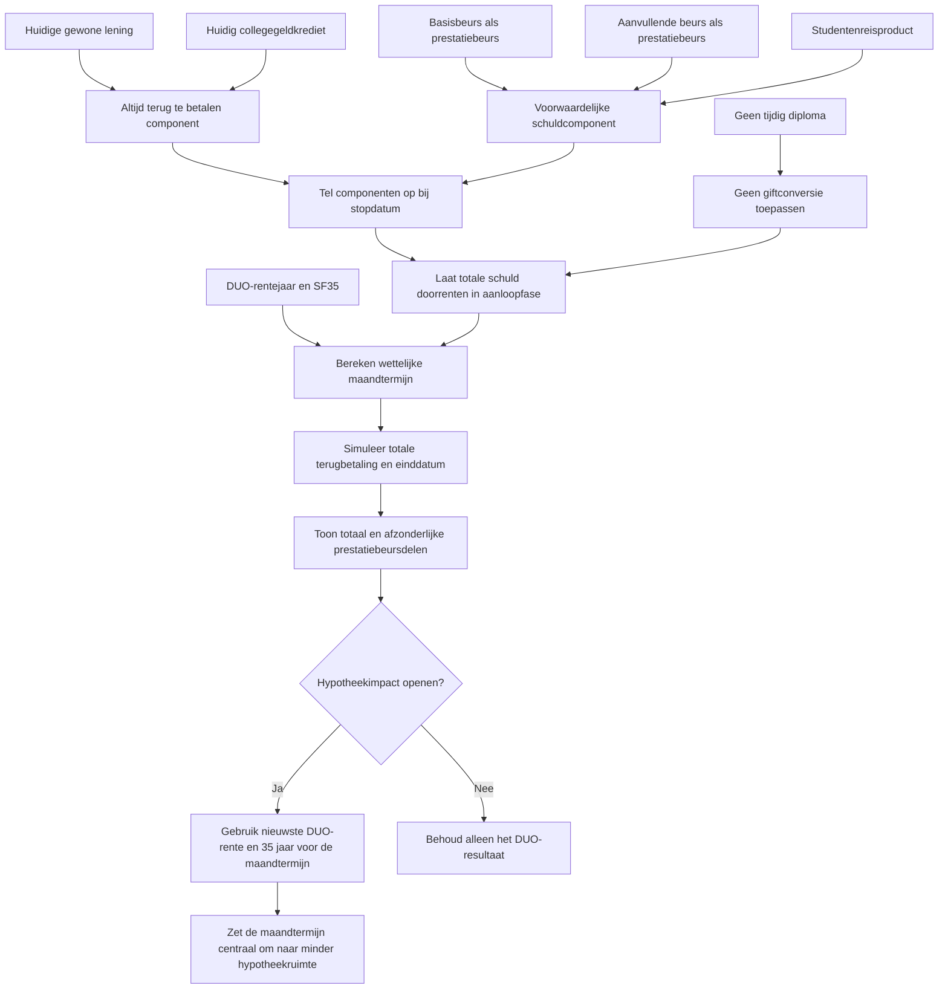
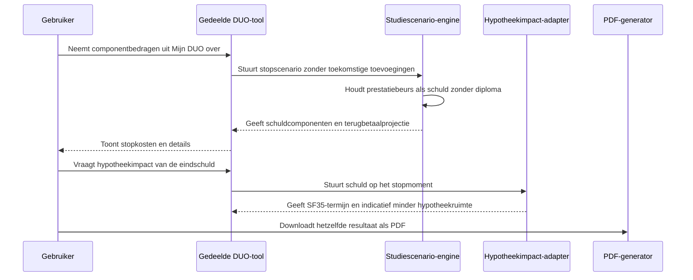

# Procesplaat Wat kost stoppen met studeren?

## 1. Identificatie

- **Tool-ID:** `duo-stoppen-kosten-prestatiebeurs`
- **Publieke route:** `/apps/duo-stoppen-kosten-prestatiebeurs`
- **Doel:** tonen welke bestaande lening-, beurs- en reisproductdelen schuld blijven bij stoppen zonder tijdig diploma.
- **Gecontroleerd op:** 2026-07-31.
- **Functionele basis:** mode `stop-cost` in `apps/_duo_simple/FocusedDuoTool.tsx`, mapping in `apps/_duo_simple/focused-logic.ts` en centrale componentensimulatie in `src/lib/duo/studeren-stoppen.ts`.

## 2. Gebruikersproces

## 3. Beslisproces

Op mobiel worden berekeningsmaand, de afzonderlijke schuld- en prestatiebeursdelen en het rentepercentage één voor één gevraagd. Een leeg of ongeldig onderdeel kan niet stil worden overgeslagen: de stap blijft zichtbaar met een gerichte fout. De laatste actie heet `Bekijk uitkomst` en blijft tijdens scrollen onderin bereikbaar. Na het resultaat kan de gebruiker invoer met behoud van antwoorden wijzigen of na bevestiging alleen deze tool opnieuw starten. Desktop behoudt het compacte formulier.

## 4. Rekenproces

## 5. Gegevensstroom en koppelingen

Er is geen profielprefill, sessieherstel of persistente toolhandoff. De gebruiker moet bedragen uit Mijn DUO zelf invoeren. Vervolglinks dragen geen financiële gegevens over.

De PDF gebruikt `apps/_duo_simple/report.ts` en toont alleen de invoer en uitkomsten van deze stopvraag. Daardoor komen titel, bedragen en bestandsnaam overeen met het scherm en wordt niet langer het brede studiescenariorapport gebruikt.

## 6. Resultaten en uitzonderingen

| Resultaat of status | Ontstaat uit | Wanneer zichtbaar | Belangrijk voor gebruiker |
| --- | --- | --- | --- |
| Totaal dat schuld blijft | Som van alle componenten zonder giftconversie | Na geldige berekening | Alleen van toepassing op het getoonde scenario zonder tijdig diploma. |
| Schuldopbouw en componenttabel | Lening, collegegeldkrediet, beurzen en reisproduct uit dezelfde snapshot | Direct na het totaal; tabel standaard gesloten | Balken tonen de onderlinge verhouding en de tabel dezelfde exacte bedragen. |
| Hypotheekimpact eindschuld | Schuld op het stopmoment, nieuwste DUO-rente en centrale hypotheekdefaults | Na één druk op de impactknop | Indicatie zonder inkomen, draagkracht, andere schulden, woningwaarde of bankbeleid. |
| Basisbeurs blijft schuld | Ingevoerde basisbeurscomponent | In details | Werkelijke omzetting hangt af van DUO-voorwaarden en diplomatermijn. |
| Aanvullende beurs blijft schuld | Ingevoerde aanvullende beurscomponent | In details | Bijzondere giftregels worden niet persoonlijk vastgesteld. |
| Studentenreisproduct blijft schuld | Ingevoerde of centraal begrensde reisproductwaarde | In details | De centrale 2026-maandwaarde telt als prestatiebeurs zolang DUO deze niet in een gift heeft omgezet. |
| Terugbetaalprojectie | Totale schuld, rentejaar en SF35 | In verdieping en PDF | Draagkracht kan de feitelijke betaling veranderen. |
| PDF | Dezelfde taakgerichte view | Na berekening | Toont dezelfde stopkosten en schuldcomponenten, zonder los rekenpad. |

Negatieve of onleesbare bedragen en een ongeldig rentejaar blokkeren. Nul is toegestaan. De waarschuwingen benadrukken dat dit geen DUO-beschikking is en dat prestatiebeurs alleen onder toepasselijke voorwaarden een gift wordt.

## 7. Functionele bronverwijzingen

- `apps/duo-stoppen-kosten-prestatiebeurs/app.json`: publieke identiteit.
- `apps/duo-stoppen-kosten-prestatiebeurs/Calculator.tsx`: activeert `stop-cost`.
- `apps/_duo_simple/FocusedDuoTool.tsx`: componentvelden, resultaat en PDF.
- `apps/_duo_simple/focused-logic.ts`: zet toekomstige toevoegingen op nul en kiest het stopscenario.
- `apps/_duo_simple/report.ts`: taakgerichte PDF met dezelfde view en begrijpelijke bestandsnaam.
- `apps/_duo_simple/ProjectedDebtMortgageImpact.tsx`: toont de optionele hypotheekimpact na een expliciete gebruikersactie.
- `apps/_duo_simple/projected-debt-mortgage-impact.ts`: vertaalt de eindschuld via de centrale DUO- en hypotheekfuncties naar een indicatie.
- `src/lib/duo/studeren-stoppen.ts`: schuldcomponenten, giftconversie en aflossimulatie.
- Regressies: `apps/duo-stoppen-kosten-prestatiebeurs/logic.test.ts` en `src/lib/duo/studeren-stoppen.test.ts`.
