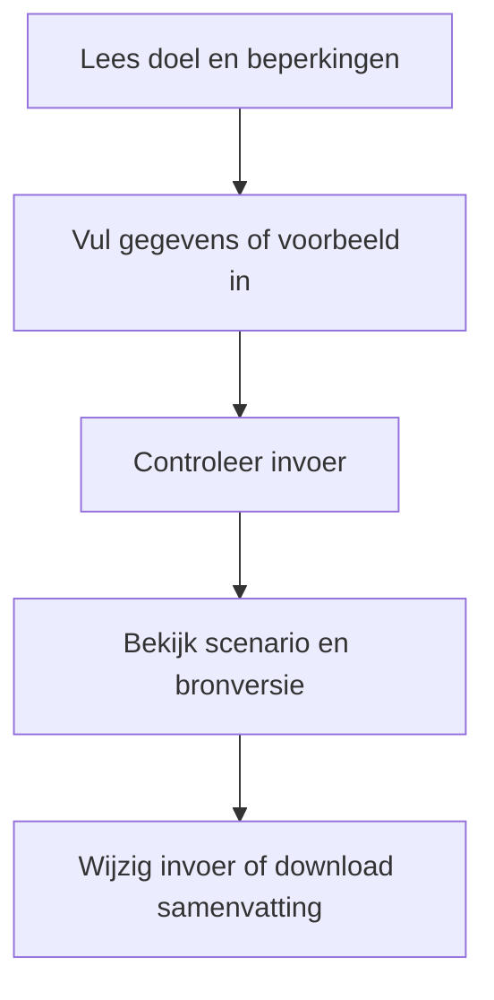
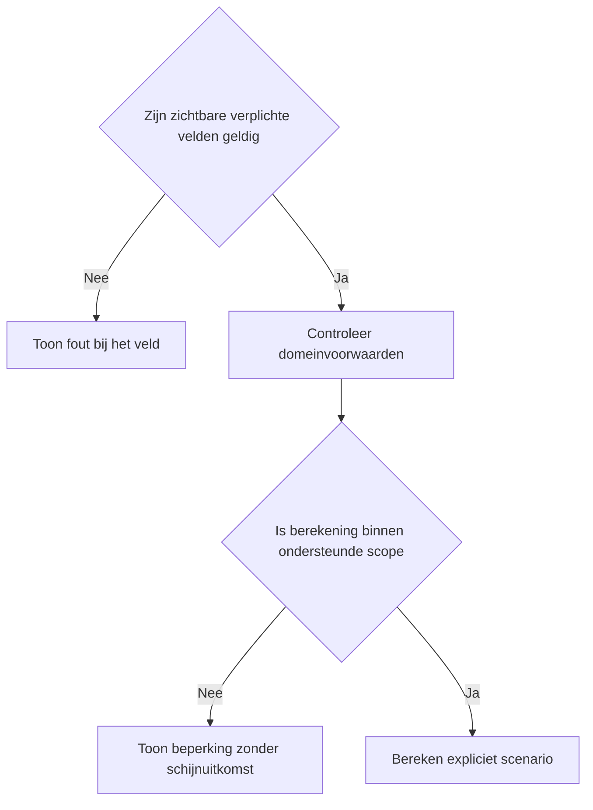
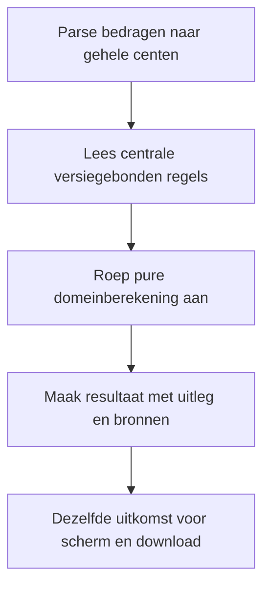

# Procesplaat EIA Investeringsvoordeel

## 1. Identificatie

Publieke voorstel-beta. De gebruiker heeft op 20 september 2026 om publicatie na testen gevraagd. Juridische status: voorstel; onafhankelijke fiscale productie-review is niet afgerond.

## 2. Gebruikersproces

Investering exclusief aftrekbare btw, relevante subsidie, privégebruik, fiscale winst, eigen effectief tarief, overige investeringen, verplichtings- en meldingsdatum, kostensoort en kwalificatievoorwaarden.

## 3. Beslisproces

Gebruikte bedrijfsmiddelen, MIA op hetzelfde middel en grondslag onder het minimum krijgen geen positieve aftrek. Onbevestigde Energielijstmatch, late melding en voortbrengingskosten blijven uitdrukkelijk voorwaardelijk.

## 4. Rekenproces

Zakelijke grondslag na subsidie, begrensd door het resterende jaarmaximum van 2026. Vergelijk 40% met voorgesteld 45,5%. Actueel voordeel gebruikt de ingevulde beschikbare winst en het eigen effectieve tarief; niet-verzilverde aftrek blijft apart.

## 5. Gegevensstroom en koppelingen

De dunne toolfaçade geeft configuratie door aan de gedeelde belastingpresentatie. De adapter valideert en mappt invoer naar de centrale domeinlaag. Alleen lokale React-state: geen profielprefill, opslag, URL-invoer, analytics of backend. De tekstdownload bevat de daadwerkelijk ingediende invoer en hetzelfde resultaatmodel als het scherm. Na een wijziging blijft de vorige uitkomst herkenbaar en is downloaden geblokkeerd tot opnieuw berekenen. De gebruiker kan terug naar alle tools zonder gegevensoverdracht.

## 6. Resultaten en uitzonderingen

Verplichtingsdatum uitsluitend in 2026. De 2027-kolom verandert alleen het percentage en bevestigt geen Energielijst 2027 of jaargrenzen. Geen verliesverrekening, schijvenberekening of cumulatie met KIA/MIA/Vamil.

De voorstelwaarschuwing en bronversie staan boven de uitkomst. Op mobiel één zichtbaar vraagveld, op desktop alle relevante velden. Bij submit met veldfouten gaat de flow naar het eerste ongeldige veld. Voorbeeld vervangt de invoer; expliciet wissen wist alleen deze tool. Opnieuw beginnen onder het resultaat vraagt bevestiging. Berekening en bronnen staan in een disclosure. Gevoelige uitvoer komt alleen in de bewuste lokale download.

## 7. Functionele bronverwijzingen

- `apps/eia-investeringsvoordeel/app.json`
- `apps/eia-investeringsvoordeel/Calculator.tsx`
- `apps/eia-investeringsvoordeel/logic.ts`
- `apps/eia-investeringsvoordeel/logic.test.ts`
- `apps/_tax_shared/TaxCalculator.tsx`
- `apps/_tax_shared/form.ts`
- `apps/_tax_shared/types.ts`
- `src/lib/tax/eia.ts`
- `src/lib/tax/money.ts`
- `src/lib/financial-constants/tax-proposals.ts`
- `src/hooks/useMobileFieldFlow.ts`
- `src/lib/financial-constants/tax-reference-2026.ts`
