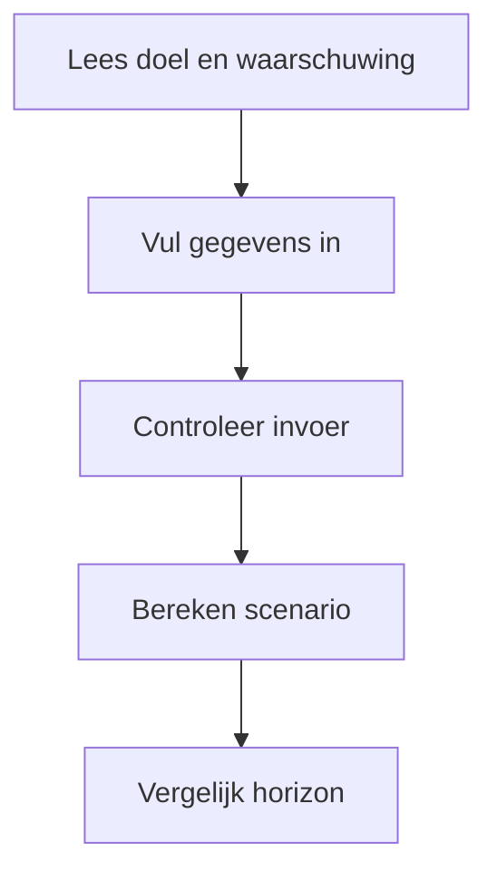
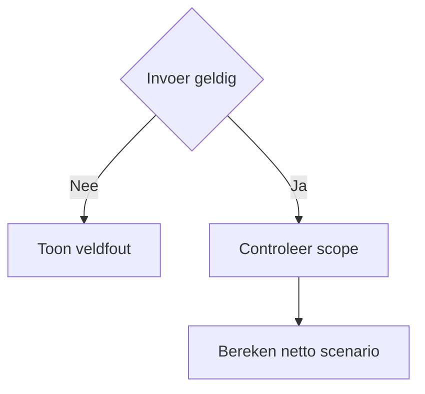
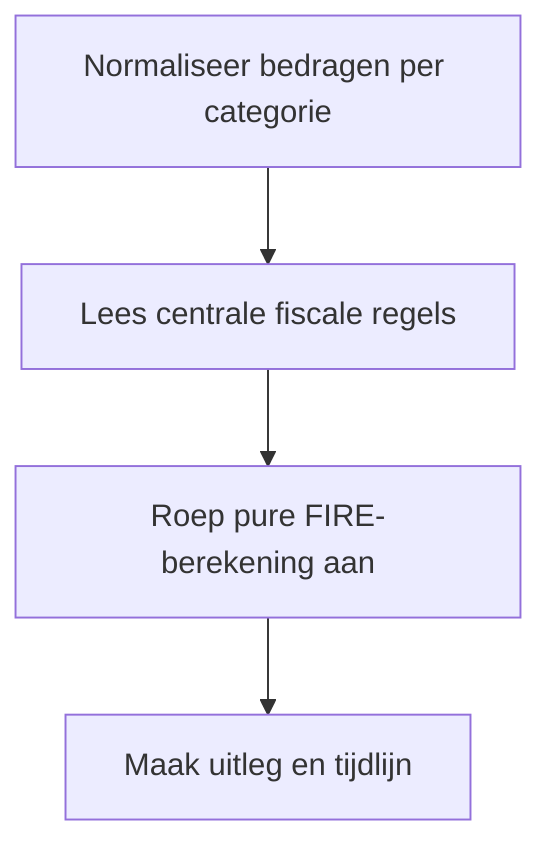

# Procesplaat FIRE na belasting

## 1. Identificatie

Educatieve beta-tool voor financiële vrijheid. De uitkomst is een scenario-inschatting en geen persoonlijk beleggingsadvies.

## 2. Gebruikersproces

De gebruiker vult vermogen, maandelijkse spaar- en beleggingsinleg, rendement per categorie, uitgaven, inflatie en horizon in, controleert de aannames en bekijkt het omslagpunt.

## 3. Beslisproces

Ongeldige of onrealistische waarden worden bij het veld gemeld. Alleen waarden binnen de ondersteunde horizon worden berekend.

## 4. Rekenproces

De pure domeinfunctie projecteert vermogen per categorie met maandelijkse inleg, categorie-rendement en inflatie en verwerkt het gekozen box-3-scenario. De gedeelde `wealth-planning`-laag houdt de categorieprojectie consistent met andere vermogenscalculators.

## 5. Gegevensstroom en koppelingen

De React-laag beheert alleen lokale invoer. Er is geen profielopslag, backend of externe beleggingskoppeling. De categorieprojectie komt uit `src/lib/planning/wealth-planning.ts`; scherm en download gebruiken hetzelfde resultaatmodel.

## 6. Resultaten en uitzonderingen

De tool toont een indicatief jaar waarin uitgaven mogelijk door vermogen worden gedragen, plus aannames en beperkingen. Rendement is onzeker; de uitkomst is geen garantie.

## 7. Functionele bronverwijzingen

- `apps/fire-na-belasting/app.json`
- `apps/fire-na-belasting/Calculator.tsx`
- `apps/fire-na-belasting/logic.ts`
- `apps/fire-na-belasting/logic.test.ts`
- `src/lib/planning/wealth-planning.ts`
- `src/lib/tax`
