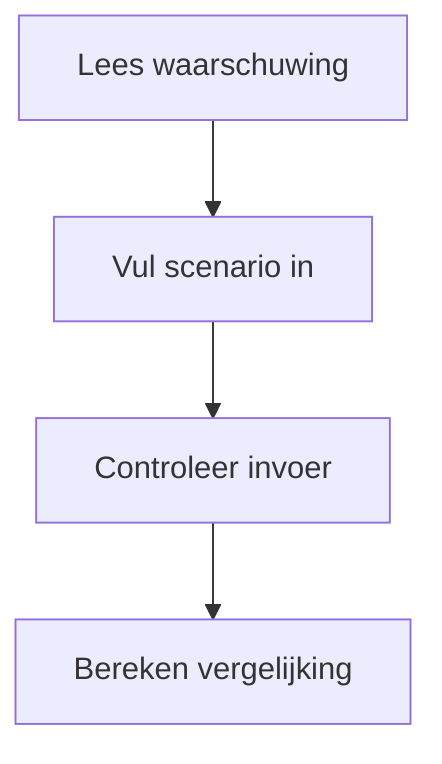
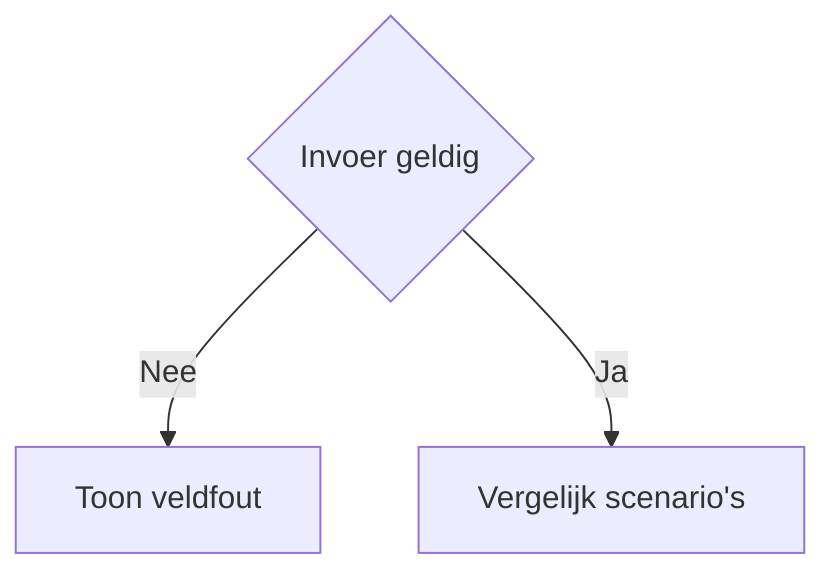
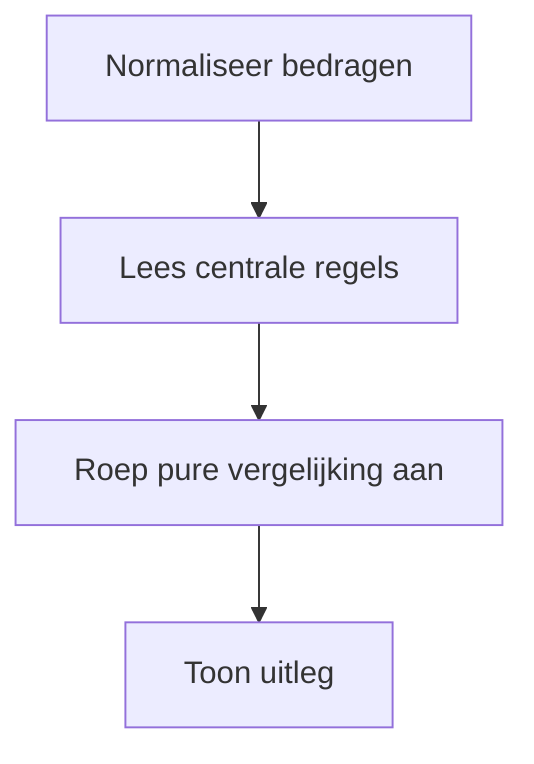

# Procesplaat hypotheek aflossen of beleggen

## 1. Identificatie
Educatieve vergelijker; de uitkomst is geen persoonlijk advies.

## 2. Gebruikersproces
Vul hypotheek, rente, vrije ruimte en beleggingsaannames in en vergelijk beide routes.

## 3. Beslisproces
Ongeldige waarden blokkeren de berekening; geldige waarden tonen beide scenario's.

## 4. Rekenproces
De pure logica vergelijkt gegarandeerde rentebesparing met een onzeker beleggingsscenario.

## 5. Gegevensstroom en koppelingen
Lokale React-state; geen backend of profielopslag. Scherm en download delen het resultaatmodel.

## 6. Resultaten en uitzonderingen
Toon verschil, aannames, onzekerheid en fiscale beperkingen; geen rendementsgarantie.

## 7. Functionele bronverwijzingen
- `apps/hypotheek-aflossen-vs-beleggen/app.json`
- `apps/hypotheek-aflossen-vs-beleggen/Calculator.tsx`
- `apps/hypotheek-aflossen-vs-beleggen/logic.ts`
- `apps/hypotheek-aflossen-vs-beleggen/logic.test.ts`
