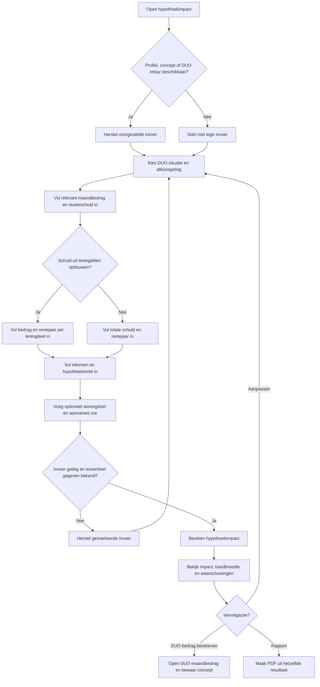
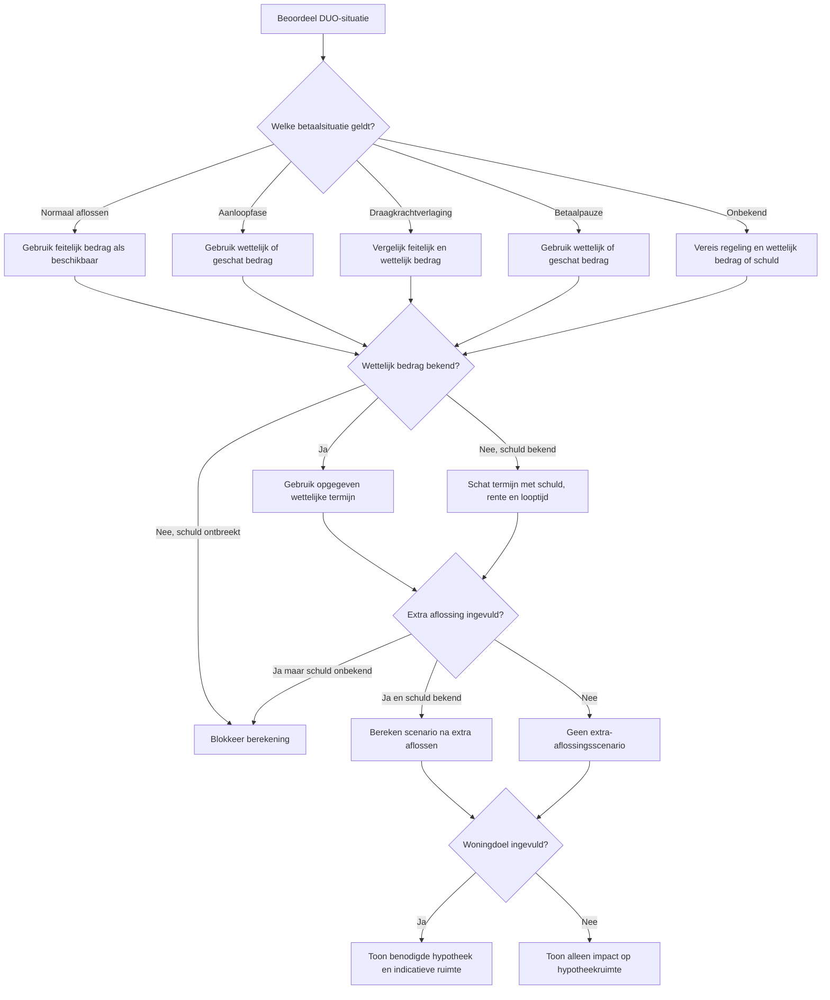
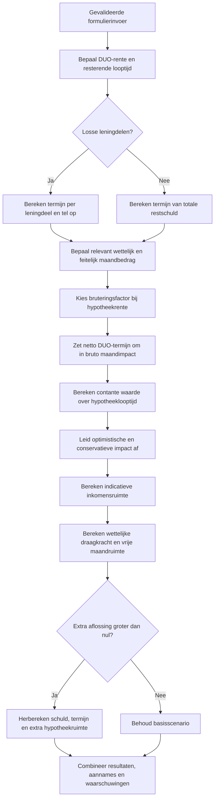
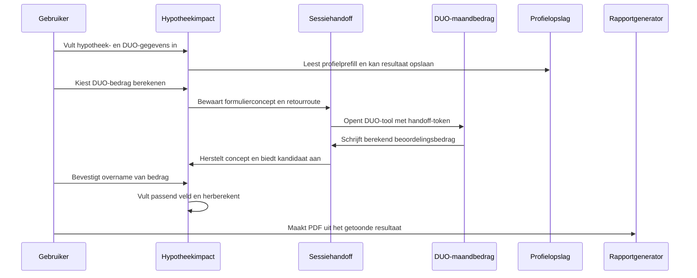

# Procesplaat Hypotheek-impact studieschuld

## 1. Identificatie

- **Tool-ID:** `hypotheek-impact-studieschuld`
- **Voormalige publieke route:** `/apps/hypotheek-impact-studieschuld` (disabled; geen statische route)
- **Doel:** indicatief tonen welk deel van de hypotheekruimte samenhangt met het DUO-maandbedrag, inclusief draagkracht, extra aflossen en een gewenst woningbedrag.
- **Gecontroleerd op:** 2026-07-31.
- **Functionele basis:** formulier en mapping in `apps/hypotheek-impact-studieschuld/form.ts`, adapter in `apps/hypotheek-impact-studieschuld/logic.ts` en centrale DUO-, hypotheek- en bronmodules uit de frontmatter.

## 2. Gebruikersproces

## 3. Beslisproces

Op mobiel volgt de gebruiker één relevante vraag per stap; alleen velden die door DUO-situatie, woningdoel of leningdelen nodig zijn tellen mee in de voortgang. Ongeldige stappen blijven staan met focus op de invoer. De vaste mobiele actiebalk respecteert de safe area en de laatste actie heet `Bekijk uitkomst`. Het resultaat krijgt focus en toont eerst de kern. `Invoer wijzigen` bewaart het volledige concept; opnieuw beginnen wist na bevestiging alleen deze tool. De browser-terugknop blijft voor routernavigatie en bouwt geen verborgen formuliergeschiedenis op. Desktop behoudt de vier compacte inhoudsblokken.

## 4. Rekenproces

De DUO-rentehistorie, standaardlooptijden, draagkrachtregels, bruteringsstaffel en indicatieve woonlastverhouding komen uit `src/lib/financial-constants/index.ts`; annuiteit en contante waarde komen uit de centrale DUO- en hypotheekfuncties. De uitkomst blijft een indicatie en geen volledige kredietacceptatie.

## 5. Gegevensstroom en koppelingen

De handoff gebruikt tijdelijke sessieopslag via `src/lib/tool-handoff.ts`; het bedrag wordt niet stil toegepast maar eerst als kandidaat aangeboden. Profielprefill en profielresultaten lopen via de centrale profielmappers. Het rapport in `apps/hypotheek-impact-studieschuld/report.ts` gebruikt dezelfde berekeningsuitkomst als het scherm.

## 6. Resultaten en uitzonderingen

| Resultaat of status | Ontstaat uit | Wanneer zichtbaar | Belangrijk voor gebruiker |
| --- | --- | --- | --- |
| Indicatieve hypotheekimpact | Gebruteerde DUO-termijn en contante waarde | Na geldige berekening | Dit is de geschatte afname van hypotheekruimte, geen offerte. |
| Bandbreedte | Feitelijk, wettelijk en eventueel geschat maandbedrag | Wanneer scenario's verschillen | Een bank kan een ander beoordelingsbedrag gebruiken. |
| Draagkrachtindicatie | Inkomen, regeling en centrale draagkrachtregels | Na berekening | Toont wettelijke termijn en resterende maandruimte naast de hypotheekimpact. |
| Extra-aflossingsscenario | Schuld en een positief extra aflossingsbedrag | Alleen wanneer beide bekend zijn | Vergelijkt lagere termijn met kortere looptijd en indicatieve extra hypotheekruimte. |
| Woningdoel | Woningprijs, eigen geld en indicatieve ruimte | Alleen bij ingevuld woningdoel | Laat een mogelijk tekort of overschot zien. |
| PDF | Dezelfde `HypotheekImpactResult` als op het scherm | Na resultaat | Bevat aannames, bronnen en waarschuwingen zonder apart rekenpad. |

Belangrijkste blokkerende fouten zijn een onbekende aflosregeling, ontbrekend relevant DUO-bedrag zonder schatbare schuld, ongeldige leningdelen, ontbrekend inkomen en ontbrekende hypotheekrente of looptijd. Een verlopen of ongeldige DUO-handoff wordt niet overgenomen; de bestaande invoer blijft dan staan. Onzekere of geschatte betaalgegevens leveren expliciete waarschuwingen op.

## 7. Functionele bronverwijzingen

- `apps/hypotheek-impact-studieschuld/app.json`: bepaalt titel, publieke status, routeafleiding en hoofdcomponent.
- `apps/hypotheek-impact-studieschuld/Calculator.tsx`: beheert formulierstappen, conditionele velden, profiel, handoff, resultaten en rapportactie.
- `apps/hypotheek-impact-studieschuld/form.ts`: bevat defaults, parsing, veldzichtbaarheid en validatie naar domeininvoer.
- `apps/hypotheek-impact-studieschuld/logic.ts`: combineert centrale DUO- en hypotheekfuncties tot de tooluitkomst.
- `apps/hypotheek-impact-studieschuld/duo-transfer.ts`: kiest na bevestiging het juiste veld voor een DUO-retourwaarde.
- `apps/hypotheek-impact-studieschuld/report.ts`: bouwt het PDF-model uit de bestaande uitkomst.
- `src/lib/duo/calculations.ts`: berekent DUO-termijnen, draagkracht en extra-aflossingseffecten.
- `src/lib/duo/mortgage-assessment.ts`: bepaalt welk DUO-bedrag voor de hypotheeksituatie relevant is.
- `src/lib/duo/debt-parts-form.ts`: valideert en totaliseert leningdelen met rentejaren.
- `src/lib/mortgage/annuity.ts`: levert de centrale annuiteitsberekening.
- `src/lib/mortgage/present-value.ts`: zet maandimpact om naar een contante hoofdsom.
- `src/lib/financial-constants/index.ts`: levert centrale DUO-, draagkracht-, bruterings- en hypotheeknormen.
- `src/lib/financial-constants/years.ts`: bepaalt ondersteunde en standaard rekenjaren.
- `src/lib/financial-constants/duo-rate-history.ts`: levert gecontroleerde DUO-rentejaren.
- `src/lib/duo-mortgage-transfer.ts`: definieert het overdrachtsresultaat vanuit DUO.
- `src/lib/profile-tool-mapping.ts`: koppelt profielvelden aan deze tool.
- `src/lib/profile-prefill.ts`: maakt gecontroleerde profielvoorstellen.
- `src/lib/profile-result-mapping.ts`: vertaalt resultaten naar profielupdates.
- `src/lib/tool-handoff.ts`: bewaart en consumeert tijdelijke overdrachten.
- `src/lib/tool-journeys.ts`: levert vervolgstappen naar andere tools.
