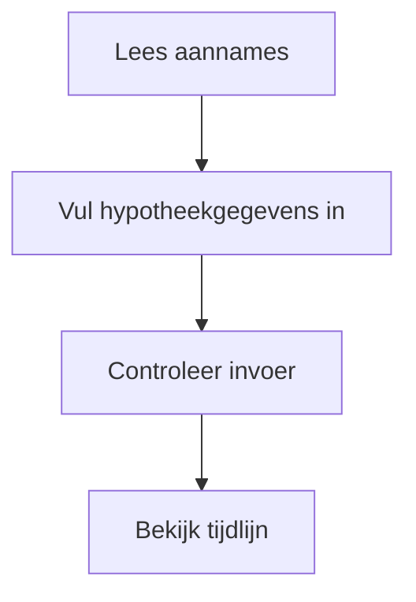
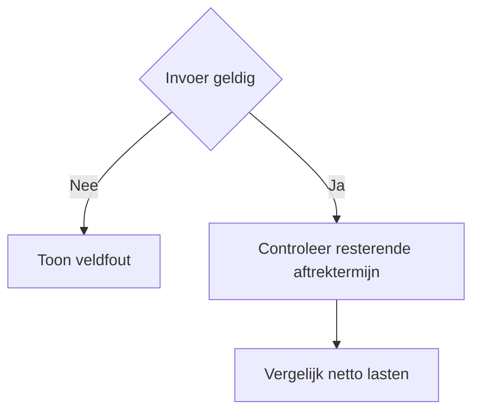
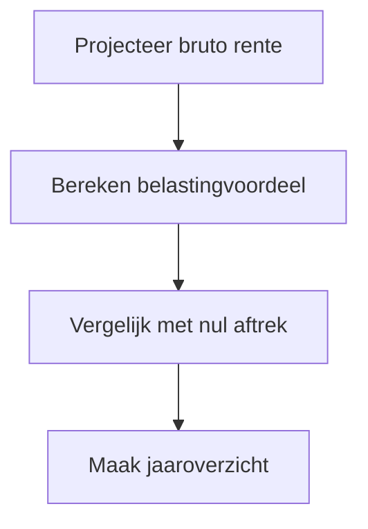

# Procesplaat hypotheekrenteaftrek

## 1. Identificatie
Indicatieve scenario-tool voor de netto gevolgen wanneer hypotheekrenteaftrek wegvalt.

## 2. Gebruikersproces
Vul inkomen, hypotheek, rente, hypotheekvorm en horizon in en bekijk het verschil per jaar.

## 3. Beslisproces
De calculator bepaalt per jaar of aftrek binnen de resterende termijn geldt en vergelijkt met geen aftrek.

## 4. Rekenproces
De centrale fiscale laag berekent het tariefvoordeel; de hypotheeklaag projecteert bruto rente en cumulatief verschil.

## 5. Gegevensstroom en koppelingen
Lokale invoer, centrale hypotheek- en belastinglogica, geen backend of profielopslag.

## 6. Resultaten en uitzonderingen
Toon jaarlijkse en cumulatieve extra netto kosten. Het scenario is indicatief en geen beleidsvoorspelling.

## 7. Functionele bronverwijzingen
- `apps/hypotheekrenteaftrek-afschaffen/app.json`
- `apps/hypotheekrenteaftrek-afschaffen/Calculator.tsx`
- `apps/hypotheekrenteaftrek-afschaffen/logic.ts`
- `apps/hypotheekrenteaftrek-afschaffen/logic.test.ts`
- `src/lib/tax`
