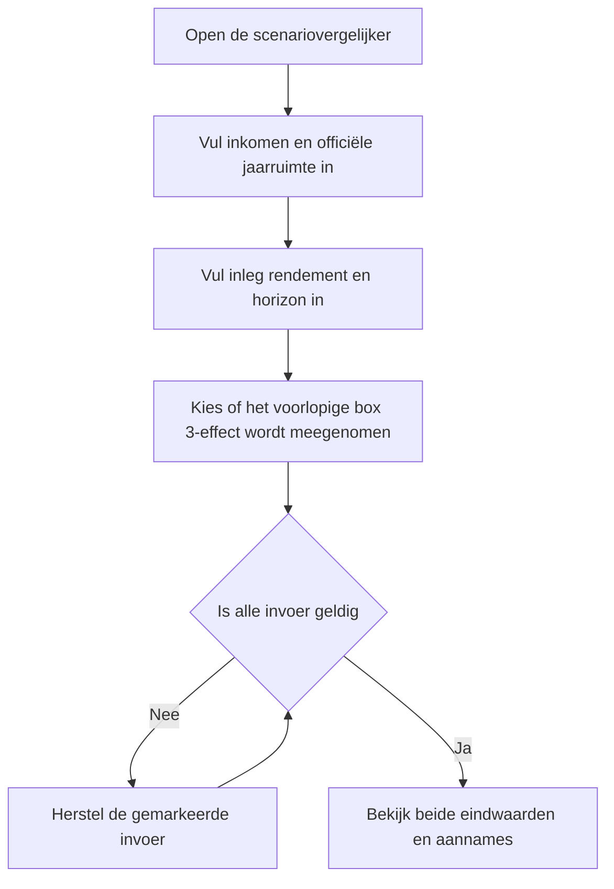
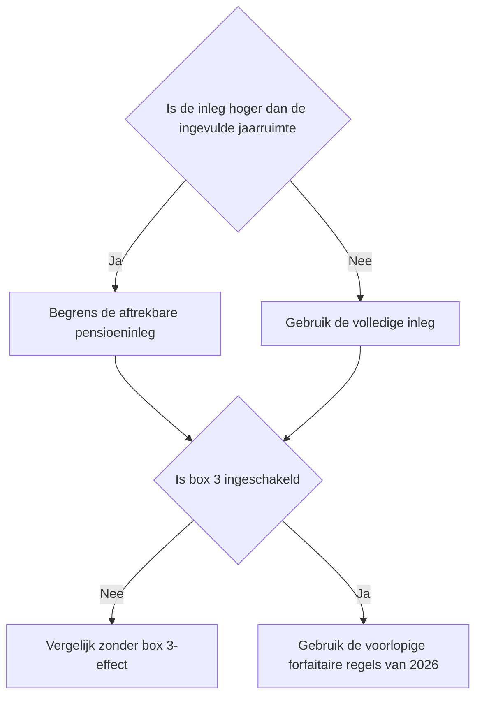
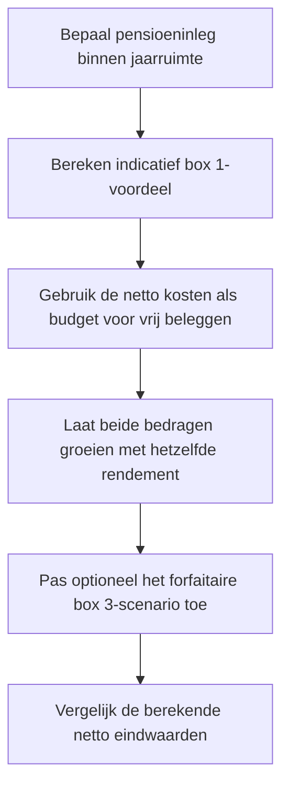

# Procesplaat Jaarruimte versus vrij beleggen

## 1. Identificatie

- **Tool-ID:** `jaarruimte-vs-vrij-beleggen`
- **Publieke route:** `/apps/jaarruimte-vs-vrij-beleggen`
- **Doel:** pensioeninleg binnen een door de gebruiker ingevulde jaarruimte neutraal vergelijken met vrij beleggen vanuit hetzelfde netto budget.
- **Gecontroleerd op:** 2026-09-18.

## 2. Gebruikersproces

## 3. Beslisproces

## 4. Rekenproces

## 5. Gegevensstroom en koppelingen

Het formulier in `apps/jaarruimte-vs-vrij-beleggen/Calculator.tsx` bewaart invoer lokaal en mappt geldige waarden naar `apps/jaarruimte-vs-vrij-beleggen/logic.ts`. De façade gebruikt de centrale pensioenhelpers in `src/lib/pension/index.ts` en de centrale Box 1- en Box 3-berekeningen. CSV en PDF worden vanuit hetzelfde berekende resultaat opgebouwd; er wordt niets extern opgeslagen.

## 6. Resultaten en uitzonderingen

De tool berekent de jaarruimte niet: de gebruiker vult het officiële bedrag zelf in. Inleg boven dat bedrag wordt apart getoond en krijgt geen berekend huidig belastingvoordeel. Zonder verwacht tarief bij uitkering blijft die belasting buiten de netto pensioenuitkomst. Het optionele box 3-pad hergebruikt ieder toekomstig jaar de voorlopige 2026-regels en is geen voorspelling.

## 7. Functionele bronverwijzingen

- `apps/jaarruimte-vs-vrij-beleggen/app.json`: publieke metadata.
- `apps/jaarruimte-vs-vrij-beleggen/Calculator.tsx`: invoer, exports en resultaatpresentatie.
- `apps/jaarruimte-vs-vrij-beleggen/logic.ts`: neutrale scenariovergelijking.
- `src/lib/pension/index.ts`: centrale pensioenprojecties.
- `src/lib/tax/box1.ts`: centrale schijftariefreferentie.
- `src/lib/tax/box3.ts`: centrale voorlopige forfaitaire Box 3-berekening.
