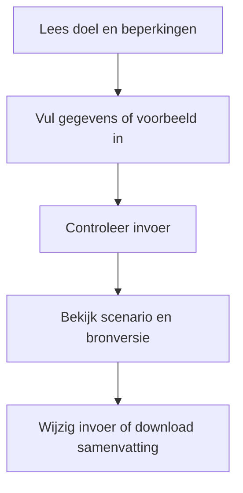
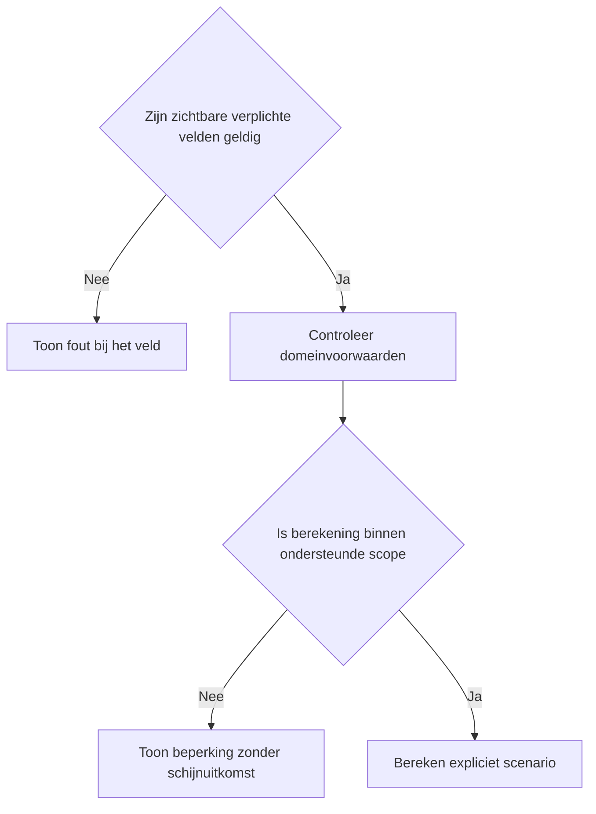
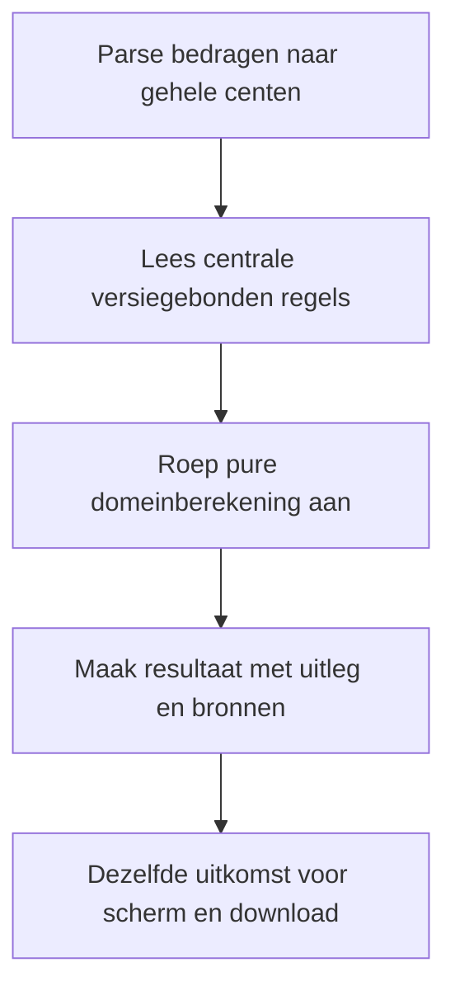

# Procesplaat Netto-inkomen 2026 versus 2027

## 1. Identificatie

Publieke voorstel-beta. De gebruiker heeft op 20 september 2026 om publicatie na testen gevraagd. Juridische status: voorstel; onafhankelijke fiscale productie-review is niet afgerond.

## 2. Gebruikersproces

Loon vóór pensioeninhouding, aftrekbare werknemerspremie, pensioen/AOW, ander inkomen zonder arbeidskorting, AOW-categorie en toepasselijke kortingen.

## 3. Beslisproces

Een AOW-overgangsjaar wordt geblokkeerd. Voor niet-gecontroleerde opbouwparameters van arbeidskorting 2027 wordt een expliciete minimum-maximumvergelijking getoond.

## 4. Rekenproces

Centrale schijventabel minus heffingskortingen, begrensd tot de berekende belasting. Loon na pensioeninhouding vormt de arbeidsgrondslag. Jaaruitkomsten delen door twaalf levert een maandgemiddelde.

## 5. Gegevensstroom en koppelingen

De dunne toolfaçade geeft configuratie door aan de gedeelde belastingpresentatie. De adapter valideert en mappt invoer naar de centrale domeinlaag. Alleen lokale React-state: geen profielprefill, opslag, URL-invoer, analytics of backend. De tekstdownload bevat de daadwerkelijk ingediende invoer en hetzelfde resultaatmodel als het scherm. Na een wijziging blijft de vorige uitkomst herkenbaar en is downloaden geblokkeerd tot opnieuw berekenen. De gebruiker kan terug naar alle tools zonder gegevensoverdracht.

## 6. Resultaten en uitzonderingen

Geen loonstrook, Zvw, box 2/3, toeslagen, woning- of persoonsgebonden aftrek of ondernemerswinst. De bandbreedte is geen voorspelling. Geen afzonderlijke inflatieclaim en geen uitbetaling van ongebruikte kortingen.

De voorstelwaarschuwing en bronversie staan boven de uitkomst. Op mobiel één zichtbaar vraagveld, op desktop alle relevante velden. Bij submit met veldfouten gaat de flow naar het eerste ongeldige veld. Voorbeeld vervangt de invoer; expliciet wissen wist alleen deze tool. Opnieuw beginnen onder het resultaat vraagt bevestiging. Berekening en bronnen staan in een disclosure. Gevoelige uitvoer komt alleen in de bewuste lokale download.

## 7. Functionele bronverwijzingen

- `apps/netto-inkomen-vergelijking/app.json`
- `apps/netto-inkomen-vergelijking/Calculator.tsx`
- `apps/netto-inkomen-vergelijking/logic.ts`
- `apps/netto-inkomen-vergelijking/logic.test.ts`
- `apps/_tax_shared/TaxCalculator.tsx`
- `apps/_tax_shared/form.ts`
- `apps/_tax_shared/types.ts`
- `src/lib/tax/income-comparison.ts`
- `src/lib/tax/money.ts`
- `src/lib/financial-constants/tax-proposals.ts`
- `src/hooks/useMobileFieldFlow.ts`
- `src/lib/financial-constants/income-comparison-rules.ts`
- `src/lib/tax/progressive-tax.ts`
