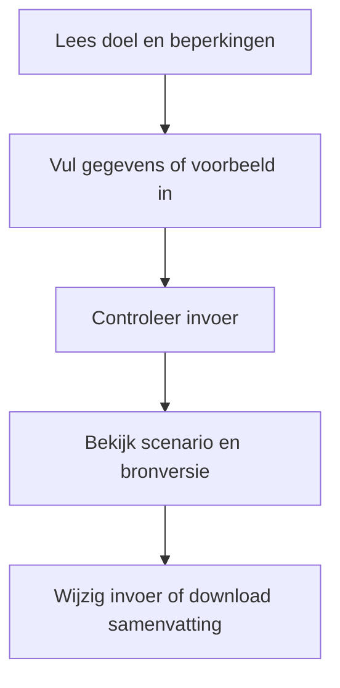
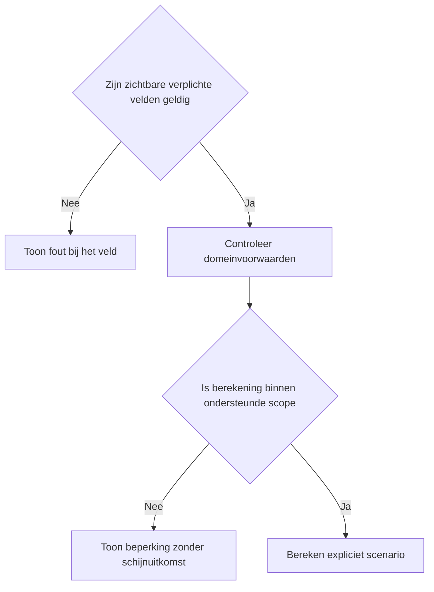
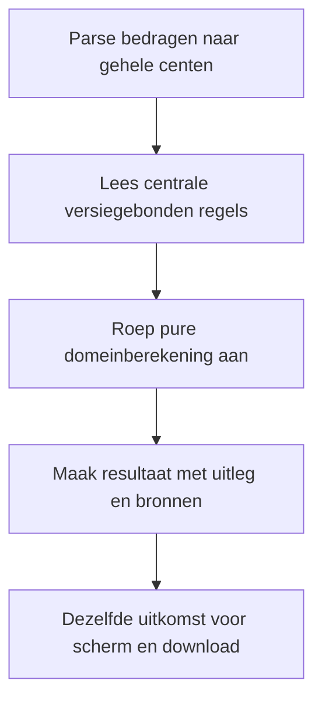

# Procesplaat Overdrachtsbelasting-check

## 1. Identificatie

Publieke voorstel-beta. De gebruiker heeft op 20 september 2026 om publicatie na testen gevraagd. Juridische status: voorstel; onafhankelijke fiscale productie-review is niet afgerond.

## 2. Gebruikersproces

Verkrijgingsdatum, koopsom, marktwaarde, vastgoedtype en bijzondere situatie. Maximaal twee kopers met aandelen, natuurlijk persoon, hoofdverblijf en relevante vrijstellingsvoorwaarden. Geboortedatum alleen waar de vrijstelling wordt getoetst.

## 3. Beslisproces

Bij gemengd vastgoed of een bijzondere situatie stopt de gewone berekening. Anders wordt het tarief per koper bepaald; leeftijd en vrijstelling zijn persoonsgebonden, de woningwaardegrens geldt voor het hele object.

## 4. Rekenproces

Grondslag is de hoogste van koopsom en marktwaarde, verdeeld naar aandeel. De verschuldigde bedragen per koper worden opgeteld. De nog niet geverifieerde startersgrens 2027 leidt waar relevant tot 0–2% bandbreedte, niet tot een vrijstellingsclaim.

## 5. Gegevensstroom en koppelingen

De dunne toolfaçade geeft configuratie door aan de gedeelde belastingpresentatie. De adapter valideert en mappt invoer naar de centrale domeinlaag. Alleen lokale React-state: geen profielprefill, opslag, URL-invoer, analytics of backend. De tekstdownload bevat de daadwerkelijk ingediende invoer en hetzelfde resultaatmodel als het scherm. Na een wijziging blijft de vorige uitkomst herkenbaar en is downloaden geblokkeerd tot opnieuw berekenen. De gebruiker kan terug naar alle tools zonder gegevensoverdracht.

## 6. Resultaten en uitzonderingen

Erfpacht, doorverkoop, bijzondere vrijstellingen en gemengd gebruik vereisen nadere grondslagcontrole. Geboortedatum na verkrijging en aandelen anders dan totaal 100% blokkeren.

De voorstelwaarschuwing en bronversie staan boven de uitkomst. Op mobiel één zichtbaar vraagveld, op desktop alle relevante velden. Bij submit met veldfouten gaat de flow naar het eerste ongeldige veld. Voorbeeld vervangt de invoer; expliciet wissen wist alleen deze tool. Opnieuw beginnen onder het resultaat vraagt bevestiging. Berekening en bronnen staan in een disclosure. Gevoelige uitvoer komt alleen in de bewuste lokale download.

## 7. Functionele bronverwijzingen

- `apps/overdrachtsbelasting-check/app.json`
- `apps/overdrachtsbelasting-check/Calculator.tsx`
- `apps/overdrachtsbelasting-check/logic.ts`
- `apps/overdrachtsbelasting-check/logic.test.ts`
- `apps/_tax_shared/TaxCalculator.tsx`
- `apps/_tax_shared/form.ts`
- `apps/_tax_shared/types.ts`
- `src/lib/tax/property-transfer.ts`
- `src/lib/tax/money.ts`
- `src/lib/financial-constants/tax-proposals.ts`
- `src/hooks/useMobileFieldFlow.ts`
- `src/lib/financial-constants/tax-reference-2026.ts`
