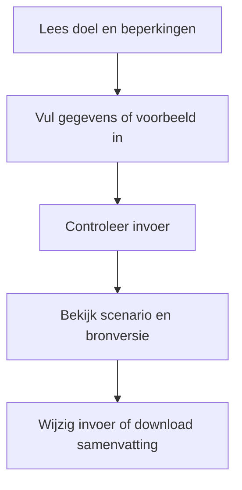
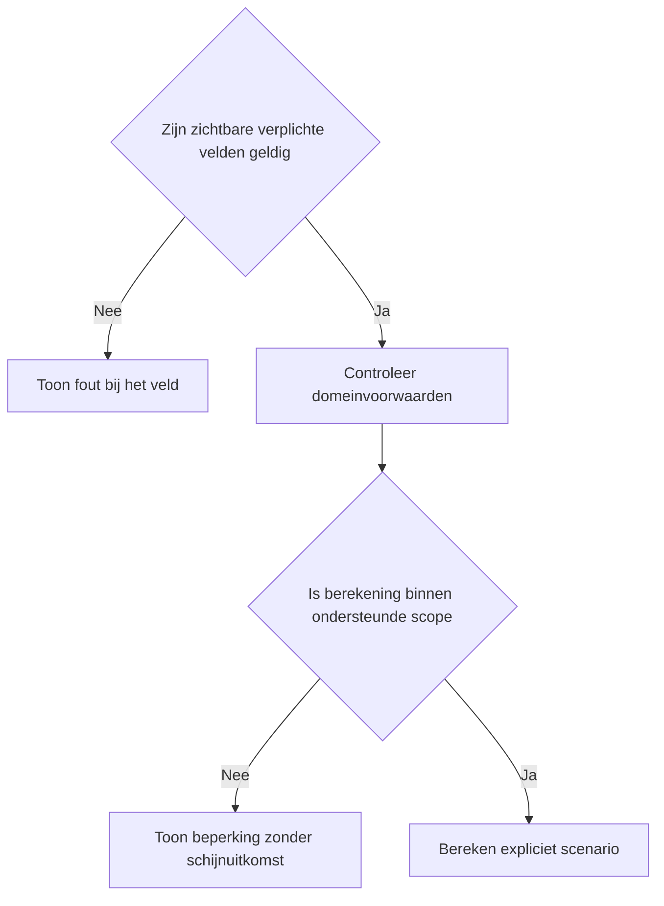
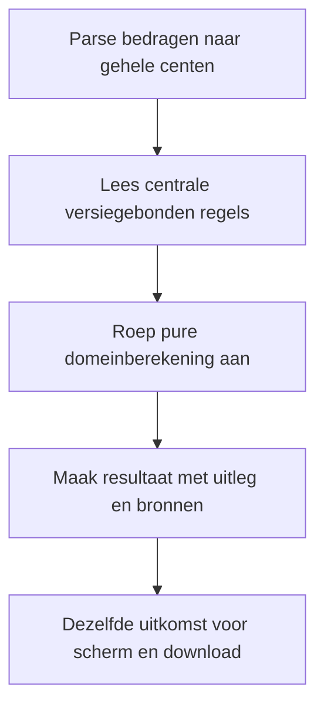

# Procesplaat Pensioenplafond-check 2027–2032

## 1. Identificatie

Publieke voorstel-beta. De gebruiker heeft op 20 september 2026 om publicatie na testen gevraagd. Juridische status: voorstel; onafhankelijke fiscale productie-review is niet afgerond.

## 2. Gebruikersproces

Pensioengevend salaris 2026, vaste bonus en of die meetelt, eigen jaarlijkse salarisgroei, hypothetische grensindexatie, franchise en optionele premiepercentages.

## 3. Beslisproces

Alleen een pensioengevende bonus telt mee. Iedere jaarrij van 2027 tot en met 2032 vergelijkt dezelfde salarisaanname met een bevroren en een hypothetisch geïndexeerde grens.

## 4. Rekenproces

Jaarlijkse salarisgroei is samengesteld. De bonus blijft het opgegeven vaste bedrag. Salaris boven de grens is geen pensioenverlies. Premieverschillen worden berekend over het verschil in grondslag na franchise.

## 5. Gegevensstroom en koppelingen

De dunne toolfaçade geeft configuratie door aan de gedeelde belastingpresentatie. De adapter valideert en mappt invoer naar de centrale domeinlaag. Alleen lokale React-state: geen profielprefill, opslag, URL-invoer, analytics of backend. De tekstdownload bevat de daadwerkelijk ingediende invoer en hetzelfde resultaatmodel als het scherm. Na een wijziging blijft de vorige uitkomst herkenbaar en is downloaden geblokkeerd tot opnieuw berekenen. De gebruiker kan terug naar alle tools zonder gegevensoverdracht.

## 6. Resultaten en uitzonderingen

Geen pensioenuitkering, geen nettoverlies en geen lijfrenteberekening. Zonder eigen premiepercentage verschijnt geen verzonnen premiebedrag.

De voorstelwaarschuwing en bronversie staan boven de uitkomst. Op mobiel één zichtbaar vraagveld, op desktop alle relevante velden. Bij submit met veldfouten gaat de flow naar het eerste ongeldige veld. Voorbeeld vervangt de invoer; expliciet wissen wist alleen deze tool. Opnieuw beginnen onder het resultaat vraagt bevestiging. Berekening en bronnen staan in een disclosure. Gevoelige uitvoer komt alleen in de bewuste lokale download.

## 7. Functionele bronverwijzingen

- `apps/pensioenplafond-check/app.json`
- `apps/pensioenplafond-check/Calculator.tsx`
- `apps/pensioenplafond-check/logic.ts`
- `apps/pensioenplafond-check/logic.test.ts`
- `apps/_tax_shared/TaxCalculator.tsx`
- `apps/_tax_shared/form.ts`
- `apps/_tax_shared/types.ts`
- `src/lib/tax/proposal-planning.ts`
- `src/lib/tax/money.ts`
- `src/lib/financial-constants/tax-proposals.ts`
- `src/hooks/useMobileFieldFlow.ts`
