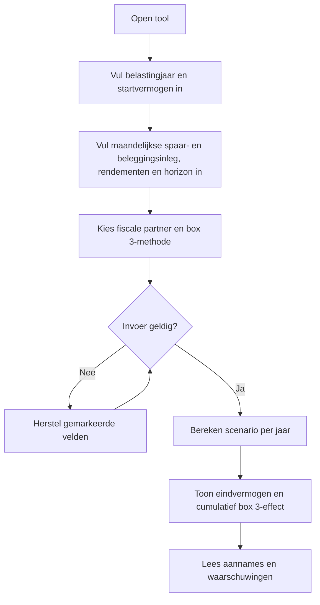
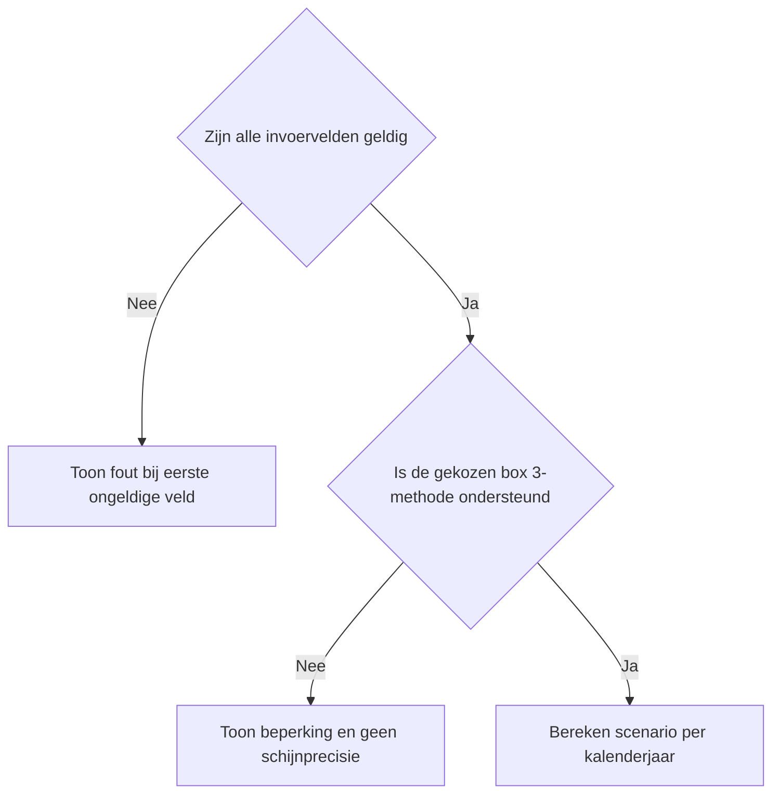
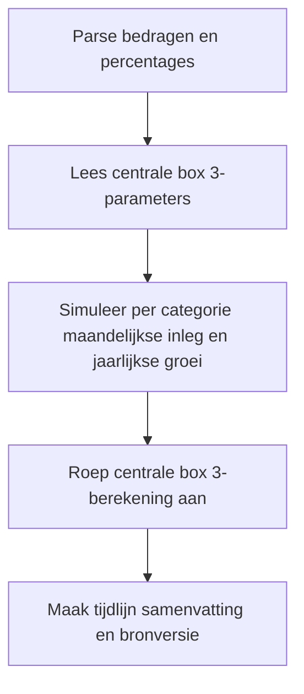

# Procesplaat eindvermogen met beleggen

## 1. Identificatie

De tool laat zien hoe een startvermogen en maandelijkse inleg per vermogenscategorie (sparen en beleggen) zich in een gekozen horizon kunnen ontwikkelen bij door de gebruiker ingevulde rendementsscenario's. De uitkomst toont een scenario mét en zonder indicatief box 3-effect. Het is geen rendementvoorspelling, beleggingsadvies of aangifteberekening.

## 2. Gebruikersproces

## 3. Beslisproces

## 4. Rekenproces

- `Calculator.tsx` verzamelt en valideert formulierinvoer.
- `logic.ts` normaliseert waarden en bouwt de jaartijdlijn.
- `src/lib/planning/wealth-planning.ts` projecteert per categorie de maandelijkse inleg en samengestelde groei.
- Box 3 wordt uitsluitend via de centrale `calculateBox3Tax`-functie berekend.
- De presentatie toont bruto groei, belasting en eindvermogen; de tool verzint geen rendement of fiscale grens.

## 5. Gegevensstroom en koppelingen

Er is alleen lokale formulierstatus: geen backend, opslag, analytics of URL-invoer. De categorieprojectie komt uit `src/lib/planning/wealth-planning.ts`; Box 3-parameters en berekening komen uit `src/lib/financial-constants` en `src/lib/tax`. De vervolglinks sturen door naar de centrale planning, Box 3 of FIRE.

## 6. Resultaten en uitzonderingen

De uitkomst toont eindvermogen per categorie en totaal, maandelijkse en totale inleg, met en zonder indicatief box 3-effect, cumulatieve belasting en een jaarlijkse tijdlijn. Ongeldige of ontbrekende invoer blokkeert de berekening.

## 7. Functionele bronverwijzingen

- `apps/prive-beleggen-eindvermogen/app.json`
- `apps/prive-beleggen-eindvermogen/Calculator.tsx`
- `apps/prive-beleggen-eindvermogen/logic.ts`
- `apps/prive-beleggen-eindvermogen/logic.test.ts`
- `src/components/WealthJourneyLinks.tsx`
- `src/lib/planning/wealth-planning.ts`
- `src/lib/tax/box3.ts`
- `src/lib/financial-constants/index.ts`

## Beperkingen

- Het ingevulde rendement is een scenario, geen verwachting of garantie.
- Kosten, transacties, dividendbelasting, vermogenswinstbelasting buiten box 3 en individuele aftrekposten vallen buiten scope.
- De box 3-uitkomst is indicatief en volgt de beschikbare centrale parameterlaag voor het gekozen jaar.
