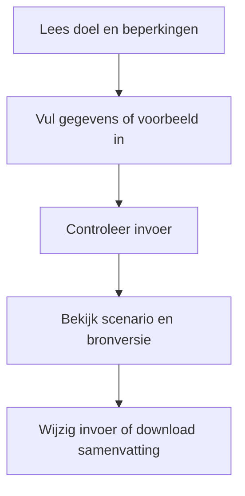
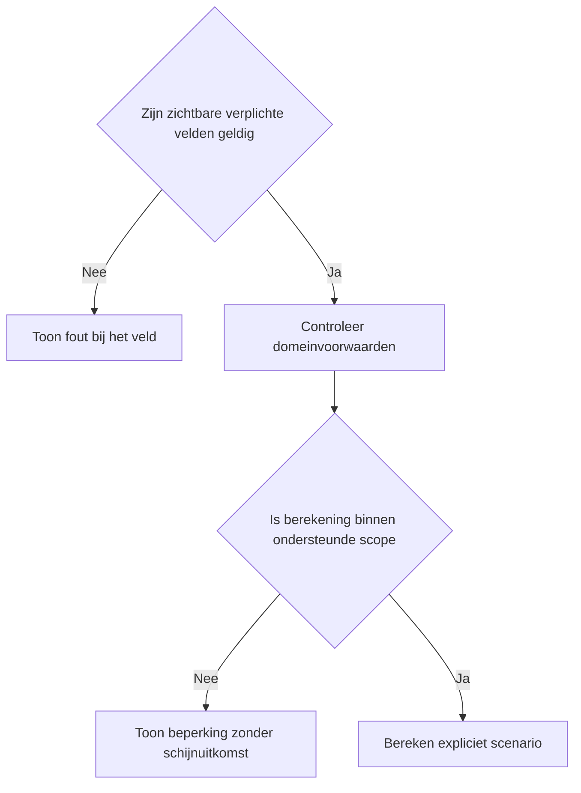
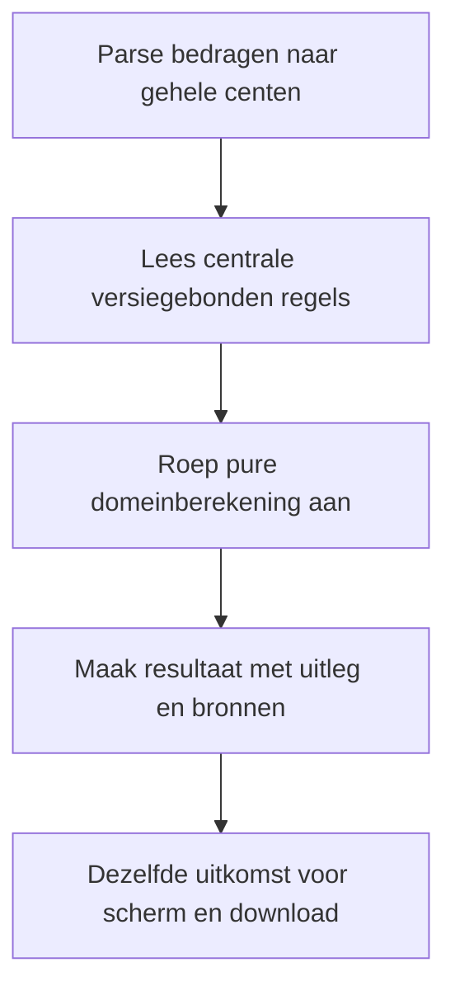

# Procesplaat Reiskostenvergoeding-check

## 1. Identificatie

Publieke voorstel-beta. De gebruiker heeft op 20 september 2026 om publicatie na testen gevraagd. Juridische status: voorstel; onafhankelijke fiscale productie-review is niet afgerond.

## 2. Gebruikersproces

Vervoerswijze, enkele reisafstand, geplande werkdagen, thuiswerk, afwezigheid, overige zakelijke kilometers en ontvangen vergoeding; werkelijke OV-kosten alleen bij de OV-route.

## 3. Beslisproces

Thuiswerk en afwezigheid verminderen het aantal feitelijke ritten. OV gebruikt werkelijke kosten, werkgeversvervoer geeft geen tweede vrijstelling voor dezelfde rit.

## 4. Rekenproces

Retourafstand maal feitelijke reisdagen plus overige zakelijke kilometers. Vergelijk 23 en 25 cent, ontvangen vergoeding, onbenutte ruimte en bedrag boven de vrijstelling.

## 5. Gegevensstroom en koppelingen

De dunne toolfaçade geeft configuratie door aan de gedeelde belastingpresentatie. De adapter valideert en mappt invoer naar de centrale domeinlaag. Alleen lokale React-state: geen profielprefill, opslag, URL-invoer, analytics of backend. De tekstdownload bevat de daadwerkelijk ingediende invoer en hetzelfde resultaatmodel als het scherm. Na een wijziging blijft de vorige uitkomst herkenbaar en is downloaden geblokkeerd tot opnieuw berekenen. De gebruiker kan terug naar alle tools zonder gegevensoverdracht.

## 6. Resultaten en uitzonderingen

De uitkomst is fiscale ruimte, geen afdwingbaar recht op vergoeding. Geen vaste 128/214-dagenregeling of thuiswerkvergoeding. Onmogelijke dagtotalen en niet-gehele dagen blokkeren.

De voorstelwaarschuwing en bronversie staan boven de uitkomst. Op mobiel één zichtbaar vraagveld, op desktop alle relevante velden. Bij submit met veldfouten gaat de flow naar het eerste ongeldige veld. Voorbeeld vervangt de invoer; expliciet wissen wist alleen deze tool. Opnieuw beginnen onder het resultaat vraagt bevestiging. Berekening en bronnen staan in een disclosure. Gevoelige uitvoer komt alleen in de bewuste lokale download.

## 7. Functionele bronverwijzingen

- `apps/reiskostenvergoeding-check/app.json`
- `apps/reiskostenvergoeding-check/Calculator.tsx`
- `apps/reiskostenvergoeding-check/logic.ts`
- `apps/reiskostenvergoeding-check/logic.test.ts`
- `apps/_tax_shared/TaxCalculator.tsx`
- `apps/_tax_shared/form.ts`
- `apps/_tax_shared/types.ts`
- `src/lib/tax/proposal-planning.ts`
- `src/lib/tax/money.ts`
- `src/lib/financial-constants/tax-proposals.ts`
- `src/hooks/useMobileFieldFlow.ts`
