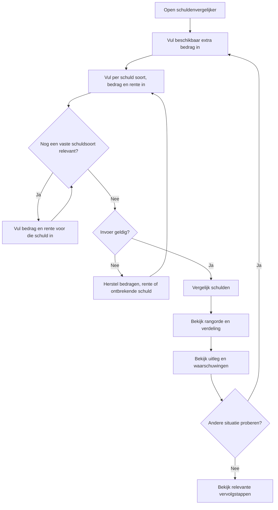
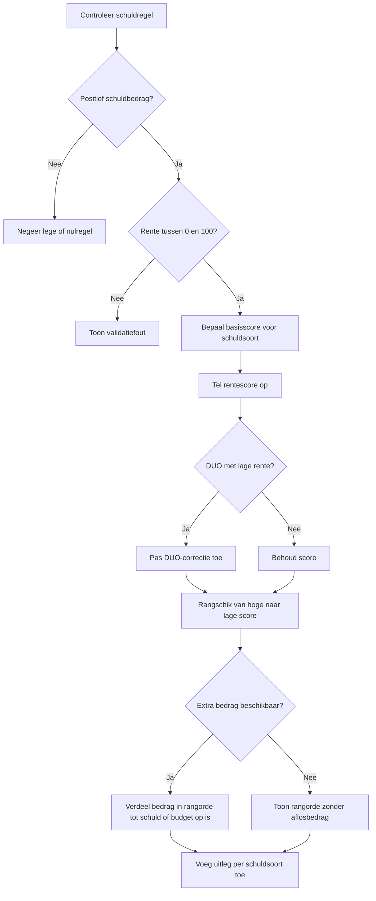
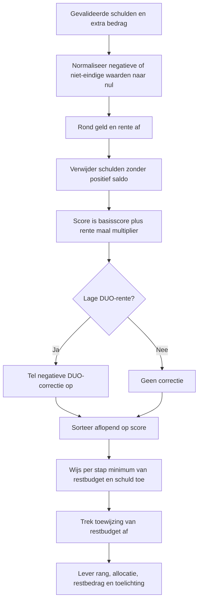
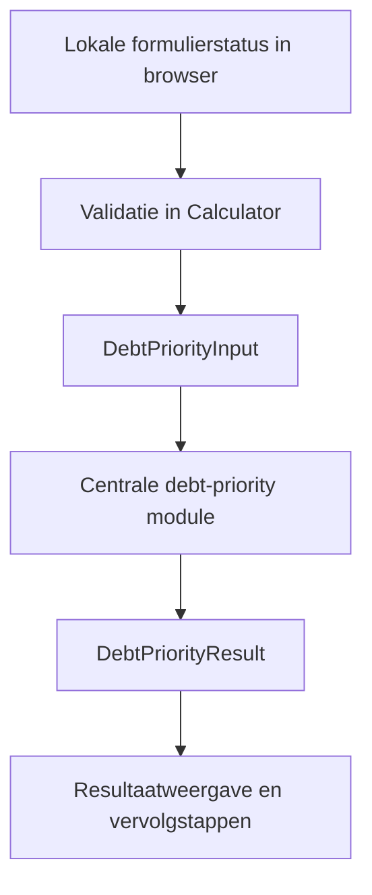

# Procesplaat Vergelijk mijn schulden

## 1. Identificatie

- **Tool-ID:** `schulden-volgorde`
- **Route bij heractivatie:** `/apps/schulden-volgorde` (momenteel uitgeschakeld en publiek niet bereikbaar).
- **Doel:** verschillende schulden rangschikken en een beschikbaar extra bedrag indicatief verdelen over de meest urgente aflosstappen.
- **Gecontroleerd op:** 2026-07-31.
- **Functionele basis:** formulier en validatie in `apps/schulden-volgorde/Calculator.tsx`, dunne exportadapter in `apps/schulden-volgorde/logic.ts` en centrale prioritering in `src/lib/planning/debt-priority.ts`.

De procesplaten hieronder beschrijven de bewaarde implementatie. Het manifest heeft `enabled: false`; daardoor ontbreken de tool en route uit de publieke registry, navigatie en buildroutes. Heractivatie vereist alleen de manifestwijziging, regeneratie en de genoemde inhoudelijke publicatiecontroles.

## 2. Gebruikersproces

De gebruiker kan voorbeeldwaarden laden. Op mobiel vormen het extra bedrag en iedere vaste schuldsoort een eigen stap; bedrag en rente blijven samen omdat zij direct van elkaar afhankelijk zijn. Lege schuldsoorten worden overgeslagen. Enter verplaatst vanuit het bedrag eerst naar rente en gaat daarna pas verder. Een resultaat verschijnt alleen na `Bekijk uitkomst`. Invoer wijzigen behoudt alle antwoorden; opnieuw beginnen wist na bevestiging alleen deze tool. Er wordt geen resultaat berekend totdat minimaal een schuld met een positief bedrag en geldige rente aanwezig is.

## 3. Beslisproces

## 4. Rekenproces

De soortbasisscores, rentemultiplier, DUO-drempel en correctie staan in `src/lib/planning/debt-priority-rules.ts`. De tool gebruikt deze rangorde alleen als routehulp; verplichte maandbetalingen, boeterente en contractvoorwaarden worden niet meegerekend.

## 5. Gegevensstroom en koppelingen

Er is geen profielprefill, sessieherstel, URL-overdracht, persistente opslag, PDF of functionele toolhandoff gevonden. Alleen de statische vervolgstappen komen uit `src/lib/tool-journeys.ts`; invoer en resultaat verlaten de lokale React-status niet.

## 6. Resultaten en uitzonderingen

| Resultaat of status | Ontstaat uit | Wanneer zichtbaar | Belangrijk voor gebruiker |
| --- | --- | --- | --- |
| Gerangschikte aflosstappen | Schuldsoort, rente en centrale scoringsregels | Na geldige submit | Hoogste score staat bovenaan; dit is geen persoonlijk financieel advies. |
| Toegewezen extra bedrag | Extra budget verdeeld over de rangorde | Per resultaatregel | Een schuld ontvangt nooit meer dan het openstaande bedrag. |
| Resterend bedrag | Extra bedrag min eerdere toewijzingen | Per stap | Laat zien hoeveel budget na die stap overblijft. |
| Genegeerde regels | Lege of nulschulden | Na berekening wanneer aanwezig | Deze regels doen niet mee aan de rangorde. |
| Vaste waarschuwingen | Beperkingen van de rekenmethode | Altijd bij resultaat | Minimumtermijnen en contractvoorwaarden blijven buiten de berekening. |

Een negatief extra bedrag, een schuld zonder geldige rente, rente buiten 0 tot 100 en een rente zonder positief schuldbedrag blokkeren submit. Gelijke scores behouden de door de invoer aangeleverde volgorde. Een extra bedrag van nul is geldig en toont de prioriteit zonder toewijzing.

## 7. Functionele bronverwijzingen

- `apps/schulden-volgorde/app.json`: bepaalt titel, publieke status, routeafleiding en hoofdcomponent.
- `apps/schulden-volgorde/Calculator.tsx`: bevat defaults, dynamische schuldregels, validatie en resultaatweergave.
- `apps/schulden-volgorde/logic.ts`: exposeert de centrale prioriteitscontracten aan de tool.
- `src/lib/planning/debt-priority.ts`: normaliseert, scoort, sorteert en verdeelt het extra bedrag.
- `src/lib/planning/debt-priority-rules.ts`: bevat de centrale scoringsparameters en drempels voor 2026.
- `src/lib/tool-journeys.ts`: levert alleen de zichtbare vervolgstappen na het resultaat.
