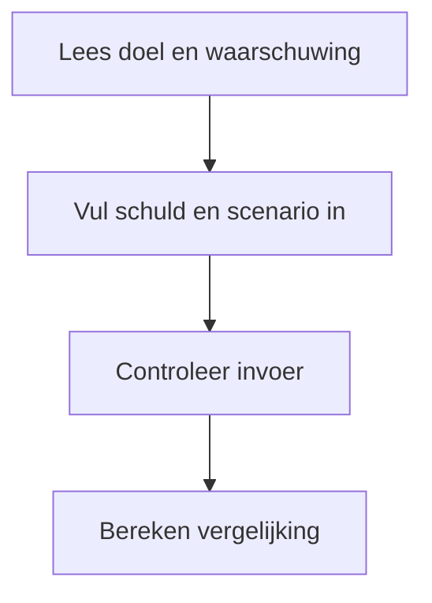
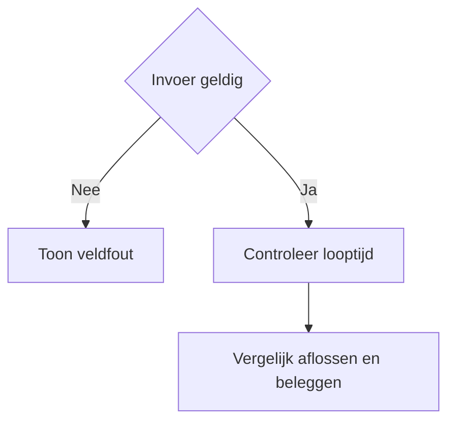
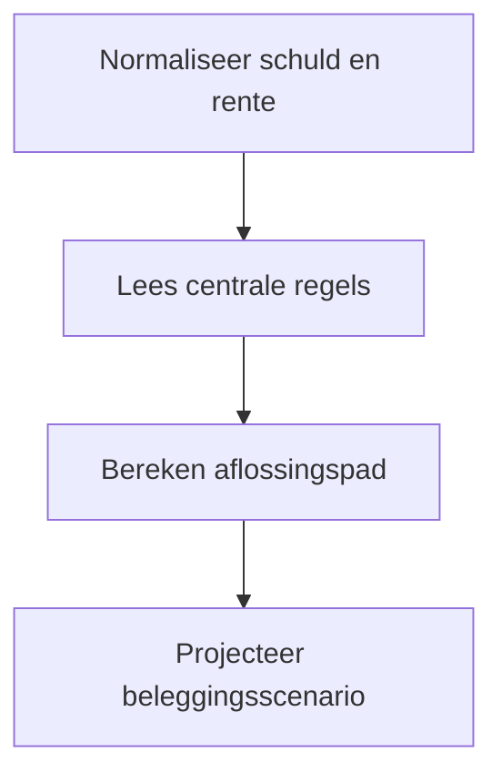

# Procesplaat studieschuld versus beleggen

## 1. Identificatie
Educatieve scenariovergelijker voor extra aflossen op studieschuld versus beleggen; geen persoonlijk advies.

## 2. Gebruikersproces
Vul schuld, rente, inkomen, extra maandbedrag en beleggingsrendement in en vergelijk de scenario's.

## 3. Beslisproces
Fouten blokkeren de berekening; geldige invoer wordt doorgerekend binnen de ondersteunde looptijd.

## 4. Rekenproces
De pure logica berekent DUO-betalingen, vervroegde aflossing en de waarde van dezelfde maandelijkse ruimte bij beleggen.

## 5. Gegevensstroom en koppelingen
Lokale React-state zonder backend of profielopslag. De zichtbare uitkomst en download delen hetzelfde resultaatmodel.

## 6. Resultaten en uitzonderingen
Toon verschil, looptijd, aannames en onzekerheid. DUO-regels en rendement kunnen wijzigen; de vergelijking is indicatief.

## 7. Functionele bronverwijzingen
- `apps/studieschuld-vs-beleggen/app.json`
- `apps/studieschuld-vs-beleggen/Calculator.tsx`
- `apps/studieschuld-vs-beleggen/logic.ts`
- `apps/studieschuld-vs-beleggen/logic.test.ts`
