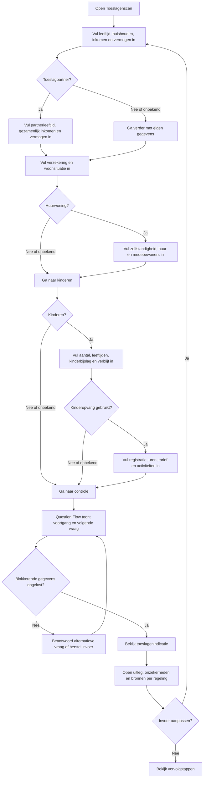
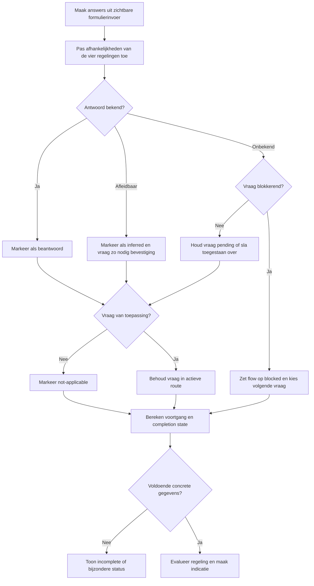
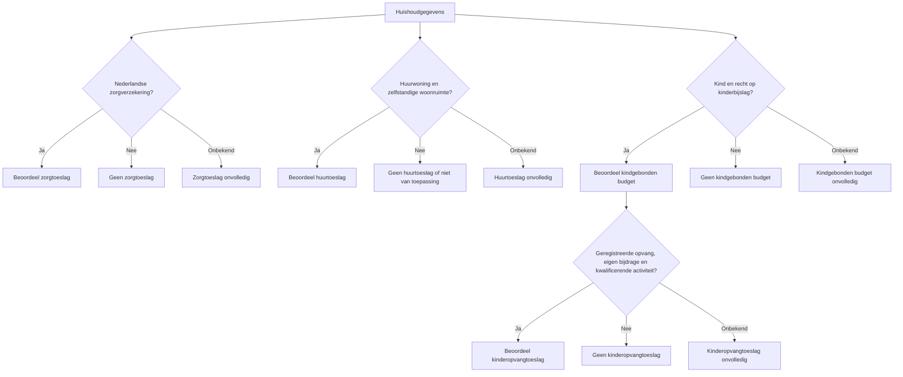
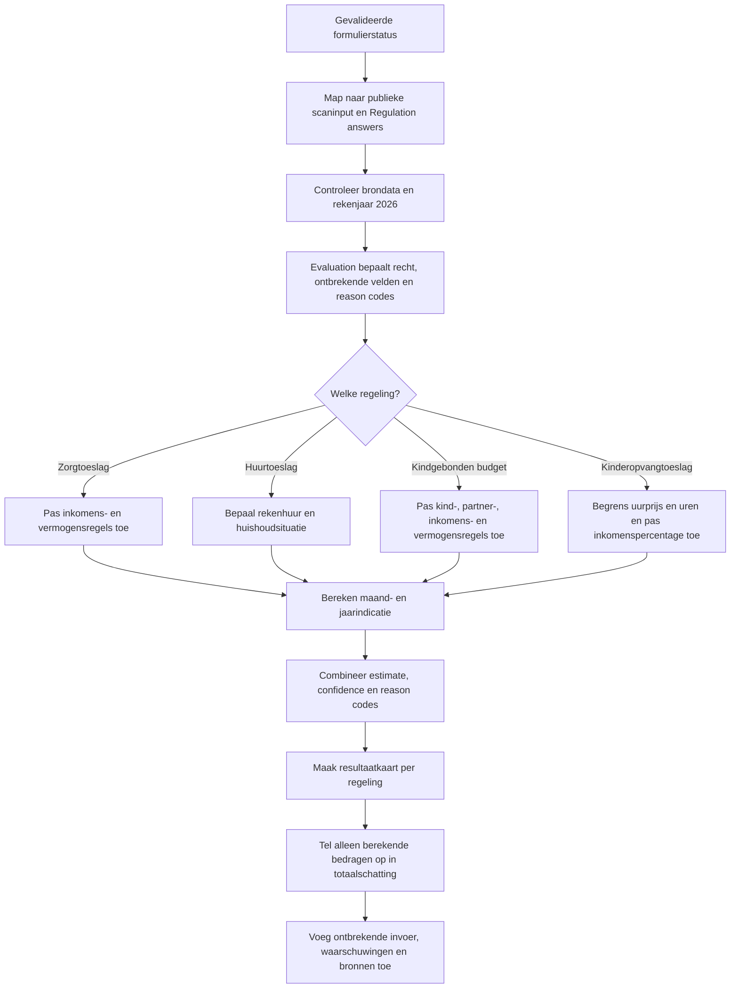
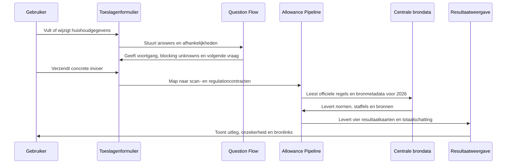

# Procesplaat Welke toeslagen passen mogelijk bij mij?

## 1. Identificatie

- **Tool-ID:** `toeslagen-scan`
- **Route bij heractivatie:** `/apps/toeslagen-scan` (momenteel uitgeschakeld en publiek niet bereikbaar).
- **Doel:** voor zorgtoeslag, huurtoeslag, kindgebonden budget en kinderopvangtoeslag signaleren of een berekening mogelijk is en waar mogelijk een officiële 2026-indicatie tonen.
- **Gecontroleerd op:** 2026-08-11.
- **Functionele basis:** alle formulierstatus en conditionele rendering staan in `apps/toeslagen-scan/Calculator.tsx`; validatie, mappings, Question Flow en viewmodels staan in `apps/toeslagen-scan/logic.ts`; centrale regels en brondata staan in de genoemde allowance-, regulations- en financial-constantsmodules.

De procesplaten hieronder beschrijven de bewaarde implementatie. Het manifest heeft `enabled: false`; daardoor ontbreken de tool en route uit de publieke registry, navigatie en buildroutes totdat een expliciete heractivatiecontrole is uitgevoerd.

## 2. Gebruikersproces

De gebruiker kan voorbeeldwaarden laden of resetten. `Weet ik niet` blijft tijdelijke intake-invoer: de centrale flow markeert wat blokkeert, welke alternatieve vraag helpt en welke antwoorden verantwoord zijn afgeleid.

## 3. Beslisproces

De scan neemt geen nieuwe beslissing op basis van recommendation-copy. Recommendations en unknown-resolutionteksten geven alleen context bij de uitkomst van Evaluation en Question Flow.

### Regelingselectie en uitzonderingen

## 4. Rekenproces

Voor huurtoeslag worden kale huur en toegestane servicekosten via `src/lib/allowances/rent-benefit.ts` verwerkt. Kindgebonden budget gebruikt kindleeftijden en huishoudsituatie via `src/lib/allowances/child-budget.ts`. Kinderopvangtoeslag gebruikt opvangsoort, uren, tarief, geregistreerde opvang, eigen bijdrage en kwalificerende activiteiten via `src/lib/allowances/childcare-benefit.ts`. Alle normen, grenzen, staffels en bronmetadata komen uit `src/lib/financial-constants/allowance-calculation-rules-2026.ts` en geregistreerde datasets.

## 5. Gegevensstroom en koppelingen

Er is geen profielprefill, sessieherstel, URL-overdracht, persistente opslag, PDF of functionele handoff naar een andere tool gevonden. Formulier en ingediend resultaat leven alleen in lokale browserstatus; statische vervolgstappen worden opgehaald uit `src/lib/tool-journeys.ts`.

## 6. Resultaten en uitzonderingen

| Resultaat of status | Ontstaat uit | Wanneer zichtbaar | Belangrijk voor gebruiker |
| --- | --- | --- | --- |
| Waarschijnlijk recht met indicatie | Evaluation positief en alle rekeninput concreet | Op de kaart van de regeling | Maand- en jaarbedrag zijn een 2026-indicatie, geen beschikking. |
| Waarschijnlijk geen recht | Een uitsluitende regel of grens is aantoonbaar geraakt | Op de betreffende kaart | Reason codes leggen de doorslaggevende reden uit. |
| Onvolledig | Een benodigd antwoord is nog unknown | Als berekening nog niet verantwoord is | De kaart benoemt ontbrekende informatie en een alternatieve vraag. |
| Bijzondere situatie | Een gemarkeerde complexe uitzondering geldt | Wanneer standaardberekening niet betrouwbaar is | Er wordt geen schijnzeker bedrag getoond. |
| Afgeleid antwoord | Inference kon een veld uit eerdere antwoorden afleiden | In flow en resultaatdetails | Het blijft herkenbaar als inferred en kan bevestiging vereisen. |
| Totaalschatting | Som van resultaatkaarten met een berekend bedrag | Wanneer minstens een bedrag bijdraagt | Onvolledige of niet-berekende regelingen tellen niet stil als nul mee. |

Validatie blokkeert ongeldige getallen, negatieve bedragen, leeftijden buiten 0 tot 120, inconsistente kindaantallen en foutieve lijsten. Conditioneel verborgen velden worden niet als actieve invoer behandeld. Complexe woon-, familie-, buitenlandse, vermogens- of opvangsituaties kunnen tot een bijzondere of onzekere uitkomst leiden. Blocking unknowns voorkomen een definitieve indicatie voor de getroffen regeling; non-blocking unknowns blijven zichtbaar als onzekerheid.

## 7. Functionele bronverwijzingen

- `apps/toeslagen-scan/app.json`: bepaalt titel, publieke status, routeafleiding en hoofdcomponent.
- `apps/toeslagen-scan/Calculator.tsx`: bevat alle zichtbare secties, conditionele velden, submitflow en resultaatkaarten.
- `apps/toeslagen-scan/logic.ts`: valideert, mappt invoer, bouwt Question Flow en maakt de publieke viewmodels.
- `apps/toeslagen-scan/types.ts`: definieert formulier-, fout-, flow- en resultaatcontracten.
- `apps/toeslagen-scan/copy.ts`: vertaalt centrale statuses en reason codes naar gebruikerscopy.
- `src/lib/allowances/advisor-experience.ts`: levert missing-inputbegeleiding, betrouwbaarheid en rapportcontext.
- `src/lib/allowances/official-calculations.ts`: orkestreert de officiële 2026-berekeningen zonder React-afhankelijkheid.
- `src/lib/allowances/scan-adapters.ts`: vertaalt publieke scaninput naar regeling-specifieke berekeningen.
- `src/lib/allowances/scan-types.ts`: definieert het publieke scancontract en regelingresultaten.
- `src/lib/allowances/regulations-pipeline.ts`: voert Regulation Evaluation, recommendations en estimates uit.
- `src/lib/allowances/definitions.ts`: beschrijft velden, afhankelijkheden en regels per toeslag.
- `src/lib/allowances/signaling.ts`: bepaalt signalen, ontbrekende invoer en vaste volgorde van regelingen.
- `src/lib/allowances/rent-benefit.ts`: berekent huurtoeslag op basis van woon- en huishoudgegevens.
- `src/lib/allowances/child-budget.ts`: berekent kindgebonden budget op basis van gezin en inkomen.
- `src/lib/allowances/childcare-benefit.ts`: berekent kinderopvangtoeslag uit opvang en activiteiten.
- `src/lib/regulations/question-flow.ts`: bepaalt volgende vraag, voortgang, blocking en completion state.
- `src/lib/regulations/evaluator.ts`: evalueert centrale Regulation Definitions.
- `src/lib/regulations/unknown.ts`: beschrijft hoe tijdelijke onbekende antwoorden worden opgelost.
- `src/lib/regulations/recommendations.ts`: levert aanvullende context zonder de rekenbeslissing te vervangen.
- `src/lib/financial-constants/allowance-calculation-rules-2026.ts`: bevat gecontroleerde 2026-normen, grenzen en staffels.
- `src/lib/financial-constants/source-datasets.ts`: registreert geldigheid, freshness en primaire bronnen.
- `src/lib/tool-journeys.ts`: levert alleen de vervolgstappen na het scanresultaat.
