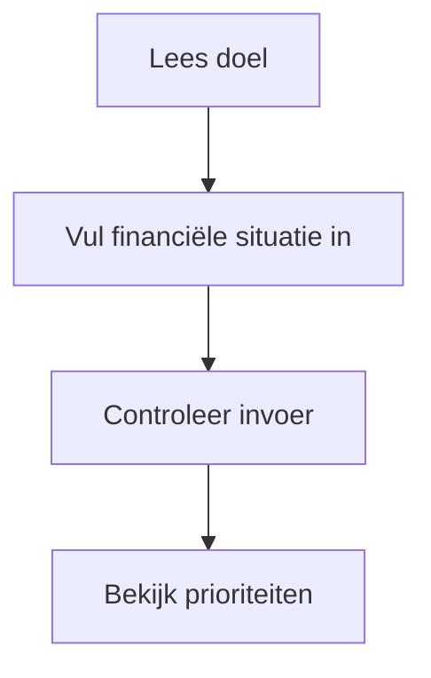
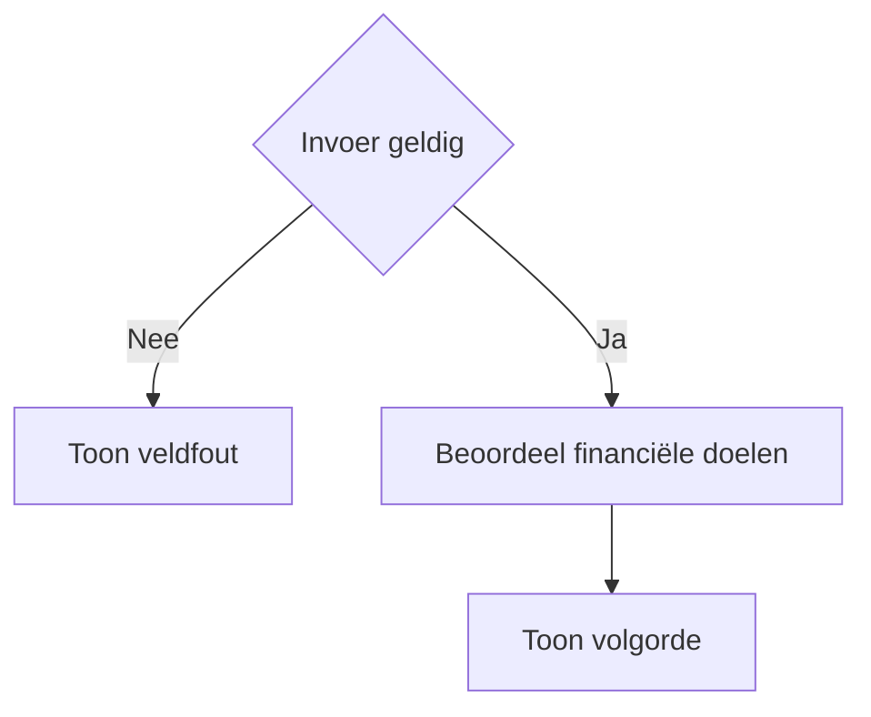
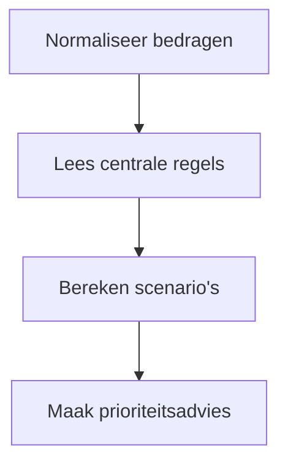

# Procesplaat volgende euro

## 1. Identificatie
Educatieve prioriteringshulp voor buffer, schuld, woning, pensioen en beleggen.

## 2. Gebruikersproces
Vul beschikbare ruimte en doelen in; vergelijk daarna de voorgestelde volgorde.

## 3. Beslisproces
De prioriteit volgt uit buffertekort, dure schuld, doelen en beleggingshorizon.

## 4. Rekenproces
De pure logica vergelijkt vrije kasstroom met buffer, rente, rendement en doelbedragen; box 3 gebruikt de gekozen methode waar van toepassing.

## 5. Gegevensstroom en koppelingen
Lokale React-state; geen backend of profielopslag. Resultaat en download delen het resultaatmodel.

## 6. Resultaten en uitzonderingen
Toon volgorde en aannames, niet een verplicht advies. Rendement, rente en fiscale regels zijn onzeker.

## 7. Functionele bronverwijzingen
- `apps/volgende-euro/app.json`
- `apps/volgende-euro/Calculator.tsx`
- `apps/volgende-euro/logic.ts`
- `apps/volgende-euro/logic.test.ts`
