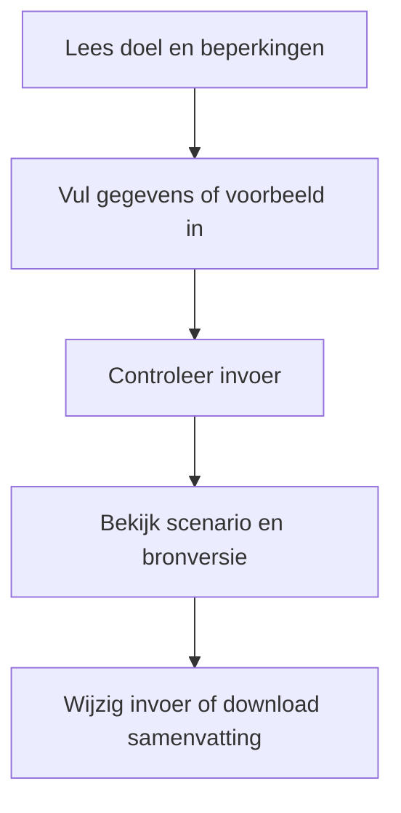
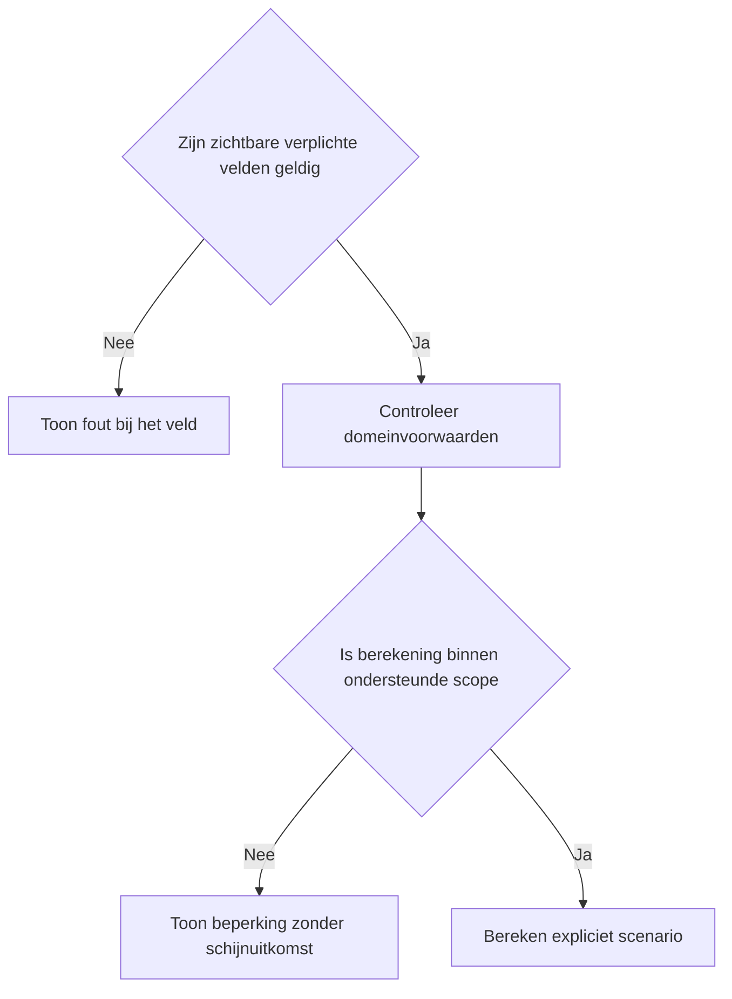
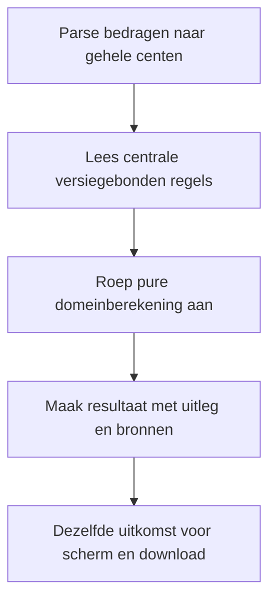

# Procesplaat Youngtimer Check 2026–2028

## 1. Identificatie

Publieke voorstel-beta. De gebruiker heeft op 20 september 2026 om publicatie na testen gevraagd. Juridische status: voorstel; onafhankelijke fiscale productie-review is niet afgerond.

## 2. Gebruikersproces

Kalenderjaar, exacte datums van ingebruikneming en terbeschikkingstelling, continuïteit eind 2025, fiscale rol, catalogus- en marktwaarde, regulier percentage en privégebruik. Bewijs, ondernemerskosten en eigen marginaal tarief verschijnen waar relevant.

## 3. Beslisproces

De engine knipt de gebruiksperiode in reguliere en youngtimerdagen. Overgangsrecht wordt afzonderlijk getoetst; het tekstverschil in de bron voor 2027 wordt zichtbaar gemeld.

## 4. Rekenproces

Dagen per regime delen door de werkelijke kalenderjaarlengte, maal de bijbehorende jaarbijtelling. Voor IB-ondernemers wordt in beide vergelijkingspaden hetzelfde kostenplafond toegepast. Het maandbedrag is een kalenderjaargemiddelde, niet een maandloonstrook.

## 5. Gegevensstroom en koppelingen

De dunne toolfaçade geeft configuratie door aan de gedeelde belastingpresentatie. De adapter valideert en mappt invoer naar de centrale domeinlaag. Alleen lokale React-state: geen profielprefill, opslag, URL-invoer, analytics of backend. De tekstdownload bevat de daadwerkelijk ingediende invoer en hetzelfde resultaatmodel als het scherm. Na een wijziging blijft de vorige uitkomst herkenbaar en is downloaden geblokkeerd tot opnieuw berekenen. De gebruiker kan terug naar alle tools zonder gegevensoverdracht.

## 6. Resultaten en uitzonderingen

Zonder bewijs van maximaal 500 privékilometers geen nulbijtelling. Ongeldige datumvolgorde en ontbrekende ondernemerskosten blokkeren. Geen volledige EV-percentagestaffel. Overgangspad 2027 vereist fiscale controle; beta is geen fiscaal goedgekeurde productie.

De voorstelwaarschuwing en bronversie staan boven de uitkomst. Op mobiel één zichtbaar vraagveld, op desktop alle relevante velden. Bij submit met veldfouten gaat de flow naar het eerste ongeldige veld. Voorbeeld vervangt de invoer; expliciet wissen wist alleen deze tool. Opnieuw beginnen onder het resultaat vraagt bevestiging. Berekening en bronnen staan in een disclosure. Gevoelige uitvoer komt alleen in de bewuste lokale download.

## 7. Functionele bronverwijzingen

- `apps/youngtimer-check/app.json`
- `apps/youngtimer-check/Calculator.tsx`
- `apps/youngtimer-check/logic.ts`
- `apps/youngtimer-check/logic.test.ts`
- `apps/_tax_shared/TaxCalculator.tsx`
- `apps/_tax_shared/form.ts`
- `apps/_tax_shared/types.ts`
- `src/lib/tax/vehicles.ts`
- `src/lib/tax/money.ts`
- `src/lib/financial-constants/tax-proposals.ts`
- `src/hooks/useMobileFieldFlow.ts`
