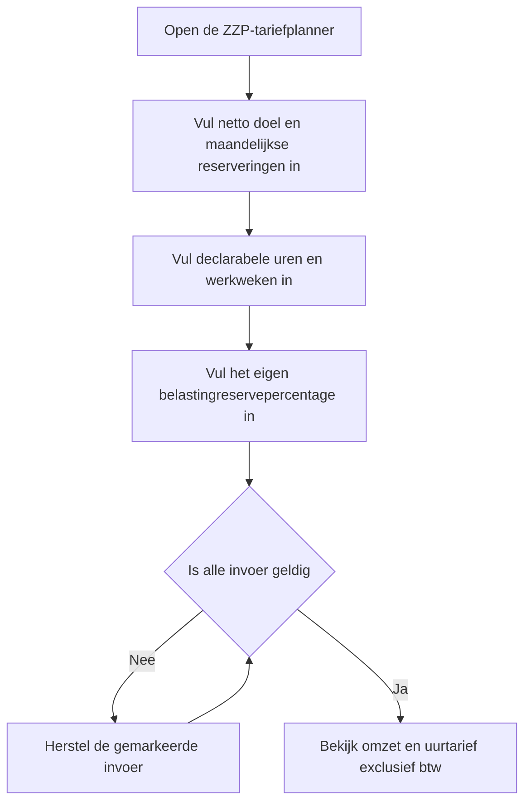
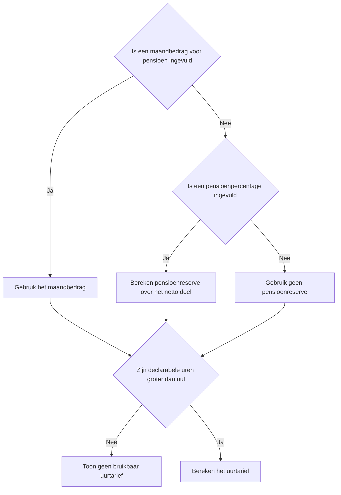
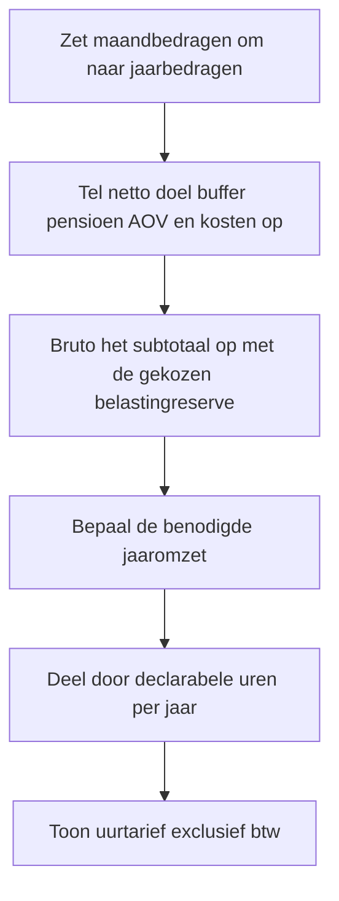

# Procesplaat Welk ZZP-uurtarief heb ik nodig?

## 1. Identificatie

- **Tool-ID:** `zzp-uurtarief`
- **Publieke route:** `/apps/zzp-uurtarief`
- **Doel:** een uurtarief exclusief btw plannen vanuit een netto doel, declarabele tijd, kosten en eigen reserveringspercentages.
- **Gecontroleerd op:** 2026-09-18.

## 2. Gebruikersproces

## 3. Beslisproces

## 4. Rekenproces

## 5. Gegevensstroom en koppelingen

`apps/zzp-uurtarief/Calculator.tsx` houdt alle invoer lokaal en geeft alleen gevalideerde waarden door aan `apps/zzp-uurtarief/logic.ts`. De scenariofaçade berekent omzet en tarief. Voor 2026 en de voorstelvergelijking 2027 gebruikt de fiscale referentie de centrale box 1-schijven, heffingskortingen en de Zvw-route voor winst uit onderneming; zakelijke kosten worden eerst van de benodigde omzet afgetrokken. De ingevoerde belastingreserve blijft een gebruikersaanname en is geen berekende aanslag.

## 6. Resultaten en uitzonderingen

De tool toont benodigde omzet, belastingreserve, declarabele uren en uurtarief exclusief btw. Nul declarabele uren levert bewust geen bruikbaar uurtarief op. De fiscale referentie trekt zakelijke kosten af en toont heffingskortingen en Zvw apart, maar activeert nog geen ondernemersaftrek, MKB-winstvrijstelling, startersaftrek, investeringsaftrek of persoonlijke aftrekposten. Daarom wordt de uitkomst niet als belastingaanslag gepresenteerd.

## 7. Functionele bronverwijzingen

- `apps/zzp-uurtarief/app.json`: publieke metadata.
- `apps/zzp-uurtarief/Calculator.tsx`: formulier en resultaatpresentatie.
- `apps/zzp-uurtarief/logic.ts`: planningsformule en waarschuwingen.
- `src/lib/tax/box1.ts`: centrale Box 1-tariefreferentie.
- `src/lib/tax/income-comparison.ts`: centrale 2026/2027-heffingskortingen.
- `src/lib/tax/zvw.ts`: centrale Zvw-bijdrage voor winst uit onderneming.
- `src/lib/financial-constants/years.ts`: centrale 2026-schijven en bronmetadata.
