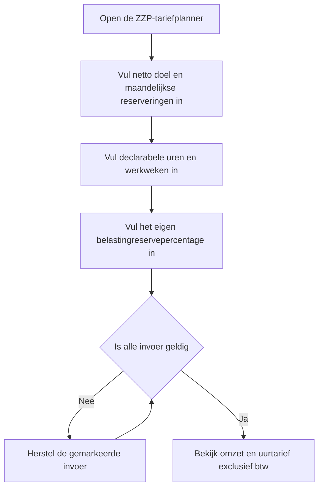
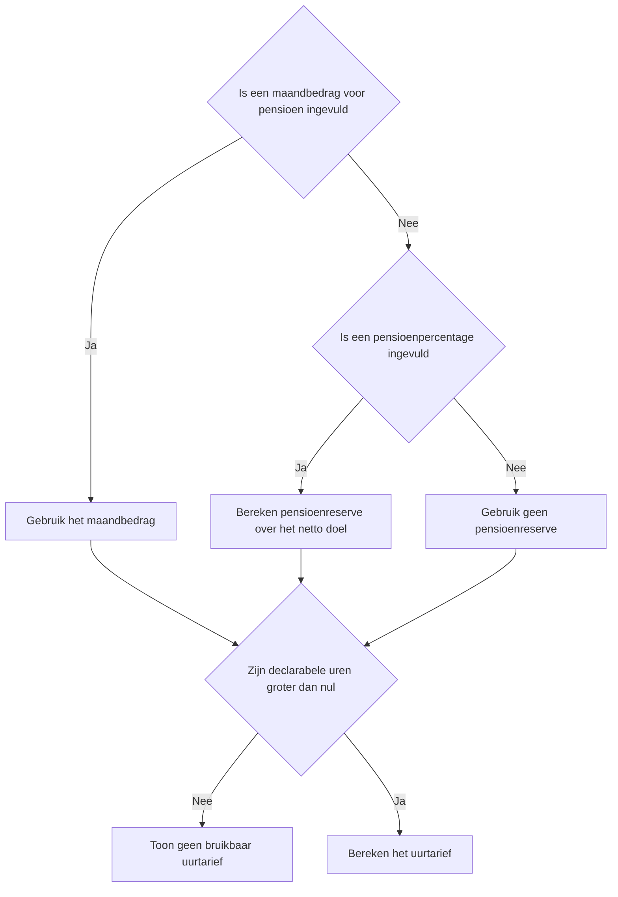
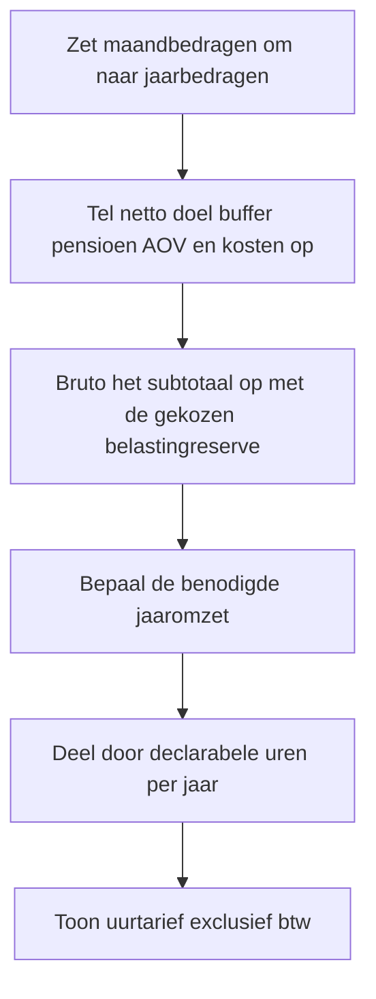

# Procesplaat Welk ZZP-uurtarief heb ik nodig?

## 1. Identificatie

- **Tool-ID:** `zzp-uurtarief`
- **Publieke route:** `/apps/zzp-uurtarief`
- **Doel:** een uurtarief exclusief btw plannen vanuit een netto doel, declarabele tijd, kosten en eigen reserveringspercentages.
- **Gecontroleerd op:** 2026-09-18.

## 2. Gebruikersproces

## 3. Beslisproces

## 4. Rekenproces

## 5. Gegevensstroom en koppelingen

`apps/zzp-uurtarief/Calculator.tsx` houdt alle invoer lokaal en geeft alleen gevalideerde waarden door aan `apps/zzp-uurtarief/logic.ts`. De scenariofaçade berekent omzet en tarief en gebruikt `src/lib/tax/box1.ts` uitsluitend voor een grove tariefreferentie. De ingevoerde belastingreserve blijft een gebruikersaanname en is geen berekende aanslag.

## 6. Resultaten en uitzonderingen

De tool toont benodigde omzet, belastingreserve, declarabele uren en uurtarief exclusief btw. Nul declarabele uren levert bewust geen bruikbaar uurtarief op. De Box 1-referentie houdt geen rekening met zakelijke kosten, heffingskortingen of ondernemersregelingen en wordt daarom niet als belastingaanslag gepresenteerd.

## 7. Functionele bronverwijzingen

- `apps/zzp-uurtarief/app.json`: publieke metadata.
- `apps/zzp-uurtarief/Calculator.tsx`: formulier en resultaatpresentatie.
- `apps/zzp-uurtarief/logic.ts`: planningsformule en waarschuwingen.
- `src/lib/tax/box1.ts`: centrale Box 1-tariefreferentie.
- `src/lib/financial-constants/years.ts`: centrale 2026-schijven en bronmetadata.
